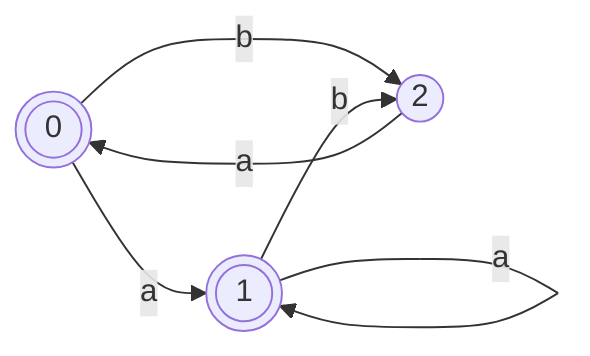

## 构造状态转换矩阵
|$I$|$I_a$|$I_b$|
|:--:|:--:|:--:|
|$\{0\}$|$\{0, 1\}$|$\{1\}$|
|$\{0, 1\}$|$\{0, 1\}$|$\{1\}$|
|$\{1\}$|$\{0\}$|$\{\varnothing\}$|
## 重新命名
|$I$|$I_a$|$I_b$|
|:--:|:--:|:--:|
|$0$|$1$|$2$|
|$1$|$1$|$2$|
|$2$|$1$|$\varnothing$|
## 画出状态转换图
