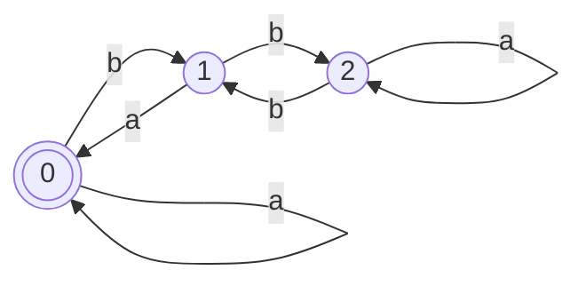

1. 首先将终态和非终态区分$\{0, 1\}, \{2, 3, 4, 5\}$
2. 检查$\{2, 3, 4, 5\}$是否要分开
   1. $\{2, 4\}_a = \{0, 1\} \subseteq \{0, 1\}$ 但 $\{3, 5\}_a = \{3，5\} \subseteq \{2, 3, 4, 5\}$属于不同子集
   2. 因此需要分开为$\{0, 1\}, \{2, 4\}, \{3, 5\}$
3. 检查$\{2, 4\}$是否需要分开
   1. $\{2\}_a = \{1\} \subseteq \{0, 1\}$ 并且 $\{4\}_a = \{0\} \subseteq \{0, 1\}$属于同一个子集
   2. $\{2\}_b = \{3\} \subseteq \{3, 5\}$ 并且 $\{4\}_b = \{5\} \subseteq \{3, 5\}$属于同一个子集
   3. 因此不用分开
4. 检查$\{3, 5\}$是否需要分开
   1. $\{3\}_a = \{3\} \subseteq \{3, 5\}$ 并且 $\{5\}_a = \{5\} \subseteq \{3, 5\}$属于同一个子集
   2. $\{3\}_b = \{2\} \subseteq \{2, 4\}$ 并且 $\{5\}_b = \{4\} \subseteq \{2, 4\}$属于同一个子集
   3. 因此不用分开
5. 检查$\{0, 1\}$是否要分开
   1. $\{0\}_a = \{1\} \subseteq \{0, 1\}$并且 $\{1\}_a = \{1\} \subseteq \{0, 1\}$
   2. $\{0\}_b = \{2\} \subseteq \{2, 4\}$并且 $\{1\}_b = \{4\} \subseteq \{2, 4\}$
   3. 因此不用分开
6. 划分结果为$\{0, 1\}, \{2, 4\}, \{3, 5\}$
7. 状态转换图如下
