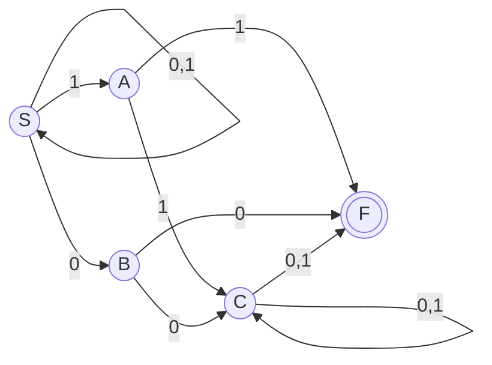
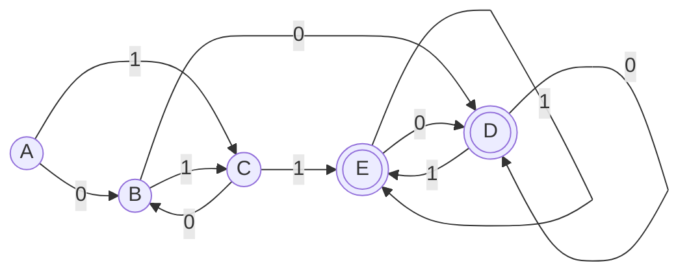
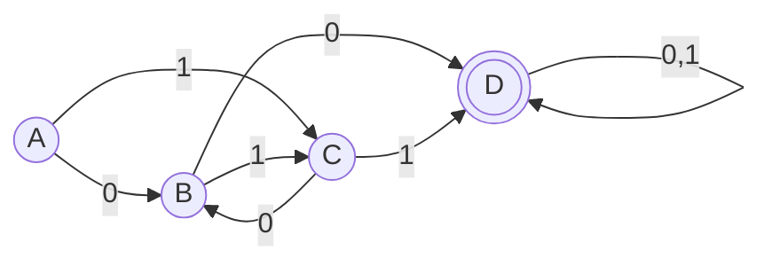

## 画出NFA

## 子集构造法DFA
### 状态转换矩阵
|$I$|$I_0$|$I_1$|
|:--:|:--:|:--:|
|$\{S\}$|$\{S, B\}$|$\{S, A\}$|
|$\{S, B\}$|$\{S, B, C, F\}$|$\{S, A\}$|
|$\{S, A\}$|$\{S, B\}$|$\{S, A, C, F\}$|
|$\{S, B, C, F\}$|$\{S, B ,C, F\}$|$\{S, A, C, F\}$|
|$\{S, A, C, F\}$|$\{S, B, C, F\}$|$\{S, A, C, F\}$|

### 重新编号
|$I$|$I_0$|$I_1$|
|:--:|:--:|:--:|
|$A$|$B$|$C$|
|$B$|$D$|$C$|
|$C$|$B$|$E$|
|$D$|$D$|$E$|
|$E$|$D$|$E$|

### DFA

## 化简

## 得到左线性文法
$$D \rightarrow B0|C1|D0|D1$$
$$C \rightarrow 1|B1$$
$$B \rightarrow 0|C0$$