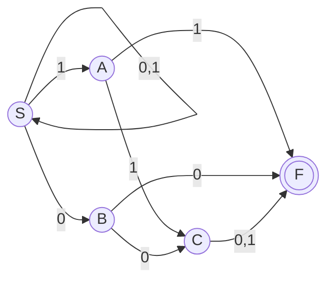
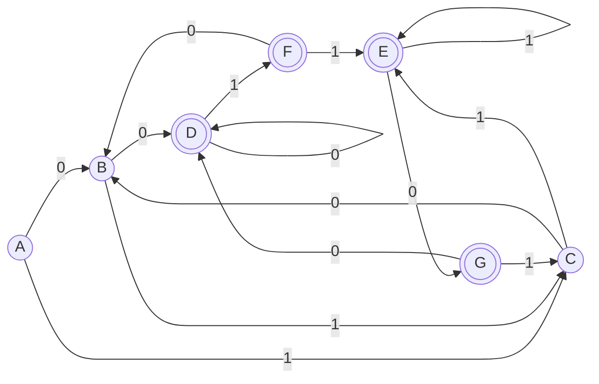

## 画出NFA

## 子集构造法DFA
### 状态转换矩阵
|$I$|$I_0$|$I_1$|
|:--:|:--:|:--:|
|$\{S\}$|$\{S, B\}$|$\{S, A\}$|
|$\{S, B\}$|$\{S, B, C, F\}$|$\{S, A\}$|
|$\{S, A\}$|$\{S, B\}$|$\{S, A, C, F\}$|
|$\{S, B, C, F\}$|$\{S, B ,C, F\}$|$\{S, A, F\}$|
|$\{S, A, C, F\}$|$\{S, B, F\}$|$\{S, A, C, F\}$|
|$\{S, A, F\}$|$\{S, B\}$|$\{S, A, C, F\}$|
|$\{S, B, F\}$|$\{S, B, C, F\}$|$\{S, A\}$|

### 重新编号
|$I$|$I_0$|$I_1$|
|:--:|:--:|:--:|
|$A$|$B$|$C$|
|$B$|$D$|$C$|
|$C$|$B$|$E$|
|$D$|$D$|$F$|
|$E$|$G$|$E$|
|$F$|$B$|$E$|
|$G$|$D$|$C$|

### DFA

## 得到左线性正规式
$$F \rightarrow D1$$
$$G \rightarrow E0$$
$$D \rightarrow B0|D0|G0$$
$$E \rightarrow C1|E1|F1$$
$$B \rightarrow A0|C0|F0$$
$$C \rightarrow A1|B1|G1$$