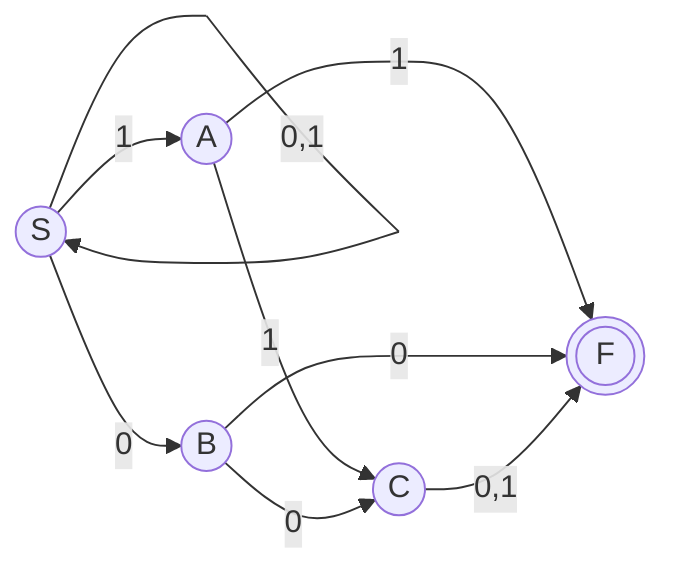

## 画出状态转换图

```mermaid
graph LR
    S((S)) -->|0,1| S
    S -->|1| A((A))
    S -->|0| B((B))
    A -->|1| C((C))
    B -->|0| C((C))
    A -->|1| F(((F)))
    B -->|0| F(((F)))
    C -->|0,1| F
```
## 得到左线性正规式
$$F \rightarrow A1|B0|C0|C1$$
$$C \rightarrow A1|B0$$
$$A \rightarrow S1$$
$$B \rightarrow S0$$
$$S \rightarrow S0|S1$$