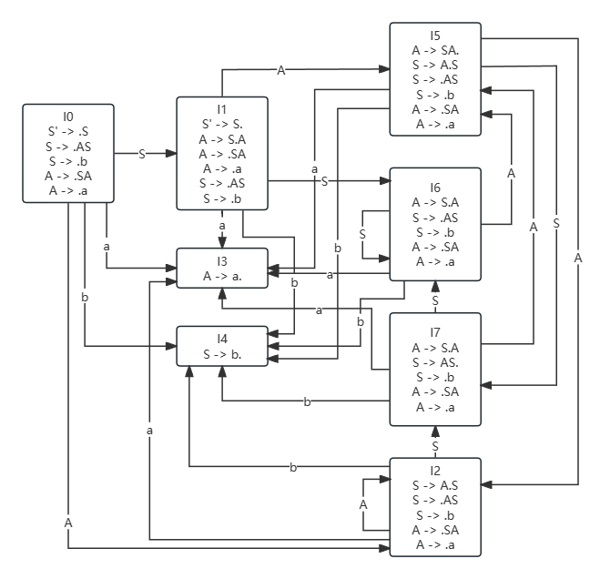
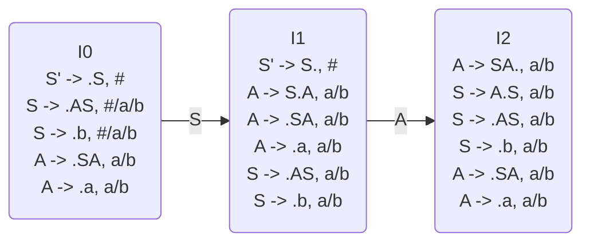

$S \rightarrow AS|b$
$A \rightarrow SA|a$
# 所有LR(0)项目
$S \rightarrow \cdot AS$
$S \rightarrow A \cdot S$
$S \rightarrow AS \cdot $

$S \rightarrow \cdot b$
$S \rightarrow b \cdot$

$A \rightarrow \cdot SA$
$A \rightarrow S \cdot A$
$A \rightarrow SA \cdot$

$A \rightarrow \cdot a$
$A \rightarrow a \cdot$

# 构造项目集规范族及其DFA
构造拓广文法，增加$S' \rightarrow S$，$S'$作为开始符号

## 是否SLR文法
$\{a, b\} \subseteq FOLLOW(S)$
$\{a, b\} \subseteq FOLLOW(A)$
我们找出一个状态集$I_8$
$S \rightarrow AS \cdot$
$A \rightarrow S \cdot A$
$A \rightarrow \cdot SA$
$A \rightarrow \cdot a$
$S \rightarrow \cdot AS$
$S \rightarrow \cdot b$
这里对于符号$a/b$需要进行$S \rightarrow AS \cdot$的规约，但是又需要$S \rightarrow \cdot b$或$A \rightarrow \cdot a$的移进
因此存在移进冲突规约，不属于SLR文法
## 是否LALR或LR(1)

写出三个状态集我们就可以发现状态$I_2$对于
$A \rightarrow SA \cdot, a/b$需要在符号$a$或$b$规约
$A \rightarrow \cdot a, a/b$需要在符号$a$移进
因此存在移进规约冲突，不是LALR或LR(1)文法