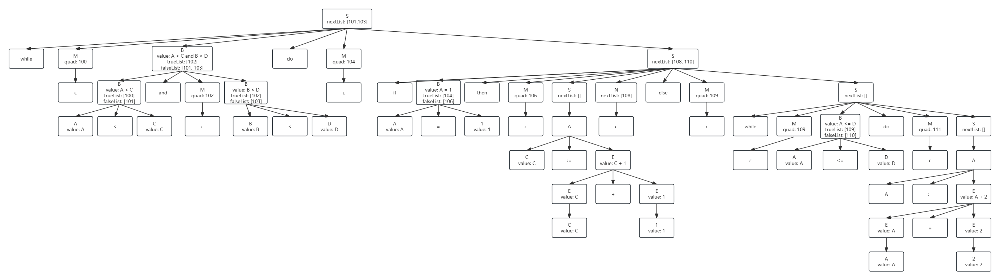

# 代码
```
while A < C and B < D do
    if A = 1 then
        C := C + 1
    else
        while A <= D do
            A := A + 2
```
# 文法
1. S $\rightarrow$ if B then M1 S1 N else M2 S2
2. N $\rightarrow \varepsilon$
3. M $\rightarrow \varepsilon$
4. S $\rightarrow$ M1 B do M2 S1
5. S $\rightarrow$ A
6. A $\rightarrow$ id := E
7. E $\rightarrow$ E + E
8. E $\rightarrow$ id/const
9.  B $\rightarrow$ id/const rop id/const
10. B $\rightarrow$ B and M B

# 语法树


# 中间代码
|地址编号|中间代码|生成该中间代码的产生式编号|回填地址位的产生式编号|
|:--|:--:|:--:|:--:|
|100|(j<,A,C,102)|9|10|
|101|(j,-,-,0)|9|?|
|102|(j<,B,D,104)|9|4|
|103|(j,-,-,0)|9|?|
|104|(j=,A,1,106)|9|1|
|105|(j,-,-,109)|9|1|
|106|(+,C,1,T1)|7|&nbsp;|
|107|(=,T1,-,C)|6|&nbsp;|
|108|(j,-,-,100)|2|4|
|109|(j<=,A,D,111)|9|4|
|110|(j,-,-,100)|9|4|
|111|(+,A,2,T2)|7|&nbsp;|
|112|(:=,T2,-,A)|6|&nbsp;|
|113|(j,-,-,109)|4|&nbsp;|
|114|(j,-,-,100)|4|&nbsp;|