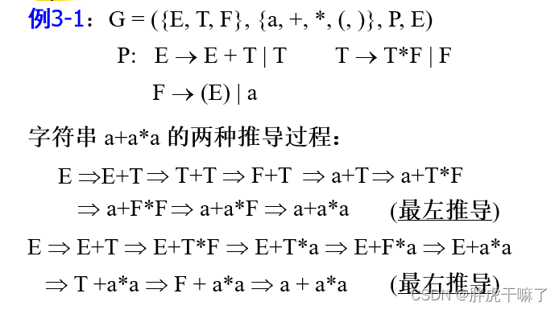
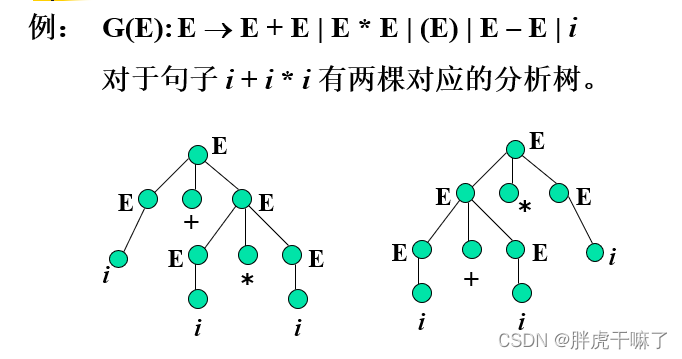

# intro

**正则文法**和**有限自动机**可以相互推导，相互等价

1. 对于每个正则文法，都存在一个等价的正则自动机，可以通过将文法的产生式规则转换为自动机的状态转移和接受状态来构建自动机。

2. 对于每个正则自动机，都存在一个等价的正则文法，可以通过将自动机的状态转移和接受状态转换为文法的产生式规则来构建文法。

## 形式语言
[参考1](https://zhuanlan.zhihu.com/p/47583941?utm_id=0)
[参考2](https://blog.csdn.net/m0_53327618/article/details/121617719)

### 定义
乔姆斯基定义*语言*是按照一定规律构成的句子和符号串的有限或无限的集合

而*形式语言*是用来精确地描述语言及其结构的手段，也称为代数语言学

### 描述方法
- 穷举所有句子
- 文法描述，语言中的每个句子用**严格定义的规则构造**，利用规则生成语言中合法的句子
- 自动机法，通过对输入句子进行**合法性检验**，区别哪些时语言中的句子，哪些不是语言中的句子

其中，文法用来精确地描述语言及其结构，自动机则是机械地刻画对输入字符串的识别过程

### 形式语法
四元组$G=(N, \Sigma, P, S)$
其中$N$是**非终结符**的有限集合，$\Sigma$是**终结符**的有限集合，$N$和$\Sigma$不相交。$V$=$N \bigcup \Sigma$，称为总词表。
P是一组**重写规则**的有限集合。$S \in N$，称为**句子符或初始符**。

- 推导
  - 如果$\alpha\beta\gamma$是某个文法总词表上的符号串，且$\beta$ -> $a$是P中的一个规则，则$\alpha\beta\gamma$ => $\alpha a \gamma$
  - 最左推导：每步推导只改写最左边的非终结符
  - 最右推导：每步推导只改写最右边的非终结符
  
- 句子
  - 文法$G=(N, \Sigma, P, S)$的句子形式通过下面的递归方式定义
    - $S$是一个句子形式
    - 句子中的字符串经过规则替换得到的也是句子
  - 不包含非终结符的句子形式成为$G$生成的句子
  - 有文法$G$生成的语言是指$G$生成的所有句子的集合，记作$L(G)$

### 形式语法类型
在乔姆斯基的语法理论中，文法被分为四种类型，分别是3型文法，2型文法，1型文法，0型文法。又分别称为正则文法，上下文无关文法，上下文相关文法，和无约束文法
- 正则文法
  - 文法规则集中只有（非终结符推出非终结符+终结符）或（非终结符推出终结符）这两种形式的文法
  - 又称左线性正则文法
  - 同理可以调整非终结符和终结符位置，得到右线性文法
  - 可以通过生成额外规则的方法将不满足正则文法定义的文法调整为符合正则文法的文法
- 上下文无关文法
  - 如果文法G的规则集P中所有规则均满足非终结符推出总词表中的字符，则称文法G为上下文文法（CFG）
- 上下文有关文法
  - 规则满足αAβ——>αγβ，α，β，γ属于总词表，且γ至少包含一个字符。
  - 是上下文无关文法的特例（α，β为空）
  - 规则右端不小于规则左端
  - 规则左部不一定仅为一个非终结符，可以有上下文限制
- 无约束文法
  - $\alpha$ -> $\beta$
### 闭包运算
$\{a, b\}^*$结果是
- 空字符串
- a
- b
- ab
- ba

大写字母认为是可以推导的，自己造出来的有内涵的
小写固定的

### 形式语言表示
构词规则用形式化语言描述
A->lB
B->l|d|lB|dB

l: 以字母打头
d: 数字

那么varl可用A和B推导出

一个文法$G$，如果存在某个句子有不只一棵分析树与之对应，则称这个文法是二义的

## 自动机
状态转换图
进入终态就能识别

词法分析器
- 输入：高级语言写的源程序，例如：a=b+c
- 输出：识别出来

### 确定的有限自动机(definite automata, DFA)
$M = (\Sigma, Q, \delta, q_0, F)$
- $\Sigma$是输入符号的有穷集合
- $Q$是状态的有限集合
- $q_0 \in Q$是初始状态
- $F$是终止状态集合，$F \subseteq Q$
- $\delta$是$Q$与$\Sigma$的直积$Q \times \Sigma$到$Q$下一个状态的映射，支配着有限状态控制的行为，状态转移函数

### 不确定的有限自动机(non-definite automata, NFA)
$M = (\Sigma, Q, \delta, q_0, F)$
- $\Sigma$是输入符号的有穷集合
- $Q$是状态的有限集合
- $q_0 \in Q$是初始状态
- $F$是终止状态集合，$F \subseteq Q$
- $\delta$是$Q$与$\Sigma$的直积$Q \times \Sigma$到$Q$的幂集$2^Q$的映射

### 两者唯一区别
NFA中$\delta$(q, a)是一个状态集合，而DFA中$\delta$(q, a)是一个状态

## 利用工具
学的是如何实现
我们实践的时候要会用这些工具自动生成

## complier编译器
高级语言 翻译成 机器语言

### 两种程序执行方式
- 解释方式
- 编译方式
  - 更有挑战性：找到一个错就停了，还是能找到所有错

### 文法
- 上下文有关文法
  - aE -> a + B
  - bE -> B + a
- 上下文无关文法
  - E -> E + E 

语法分析应该用上下文无关文法描述

A -> lB
B -> l|d|lB|dB
这样就不好，B在两边（第一个公式的右边，第二个公式的左边）

### 编译过程
1. 词法分析Scanner
    - 将源程序的字符流识别 -> 等长的内部形式(属性字)
    - 通过第三章我们就可以将形式化语言弄成有点状态图
    - (Token-name, Attribute-value)
    - 所依循的是语言的**词法规则**
    - 描述词法规则的有效工具是**正规式**和**有限自动机**
    - 分析示例
      - 是个变量，就插入**符号表**，然后标识符对应的单词值就去找符号表中的第几个

2. 语法分析Parser
   - 根据语法规则，识别出各个语法单位（短语、子句、语句、程序段、程序）生成另一种内部表示（语法分析书或其他中间表示）
   - 语法规则通常用上下文无关文法描述
   - 方法：递归子程序法、LR分析法、算符优先分析法
   - 正着*推导*（最左推导、最右推导），反着*规约*

3. 语义分析中间代码生成
   - 进行静态语义检查，如果正确则进行中间代码的翻译
   - 按照语法树的层次关系和先后次序，逐个语句地进行语义处理。
   - 主要任务： 进行类型审查，审查每个算符是否符合语言规范，不符合时应报告错误。
     - 变量是否定义
     - 类型是否正
   - 边分析就可以生成中间代码了
   - 中间代码是一种独立于具体硬件的记号系统，或者与现代计算机的指令形式有某种程度的接近，或者能比较容易地变换成机器指令
     - 任务：将各类语法单位，如“表达式”、“语句”、“程序”等翻译为中间代码序列
     - 输入：句子
     - 输出：中间代码序列
   - 中间代码形式：四元式、三元式、逆波兰式等
   - 方法：语义子程序、DAG图、语法制导翻译
4. 优化
5. 目标代码生成

源程序 -> 中间代码：前端，根据是C语言还是Java还是Python...
中间代码 -> 目标代码: 后端，根据Windows还是Mac还是Linux...
