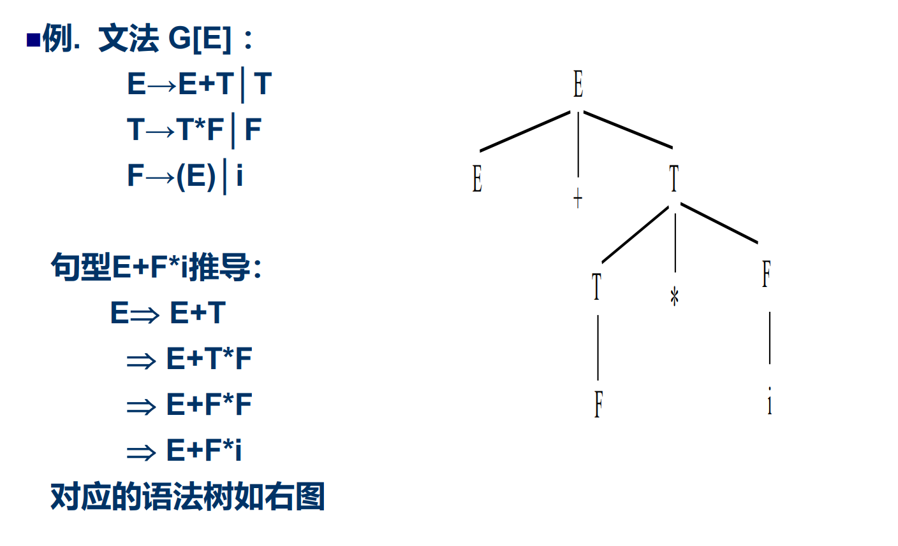
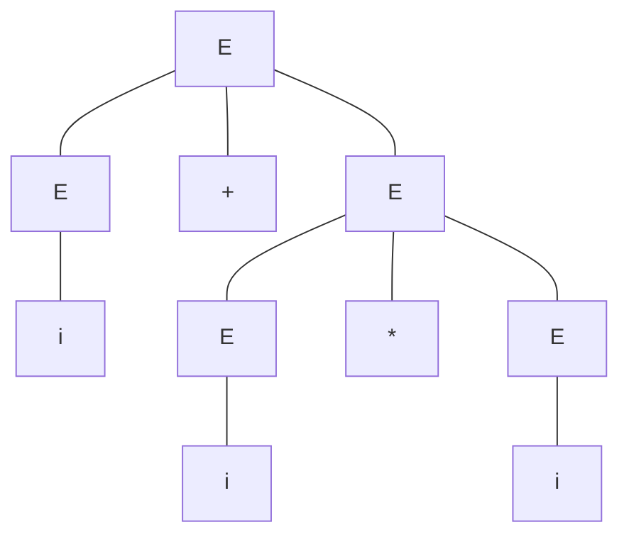
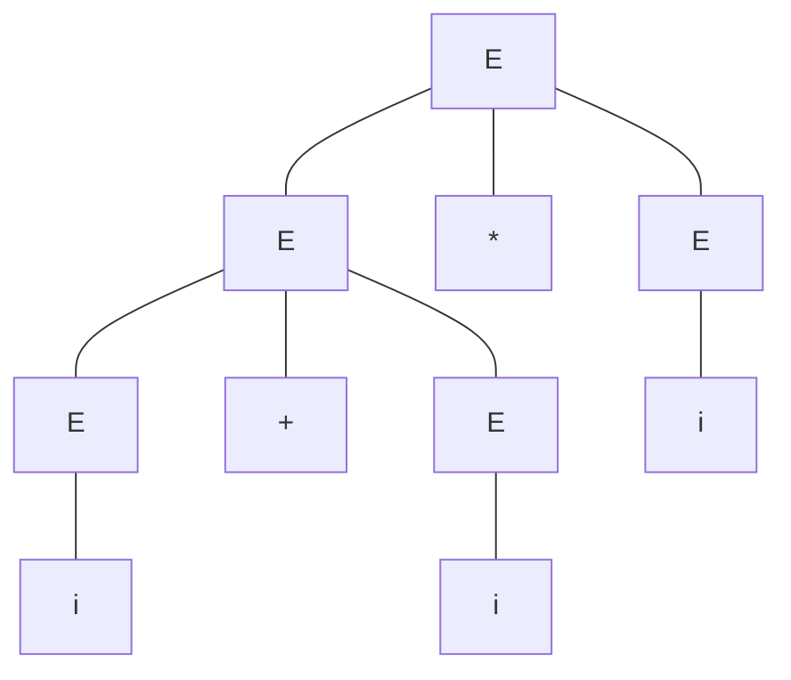
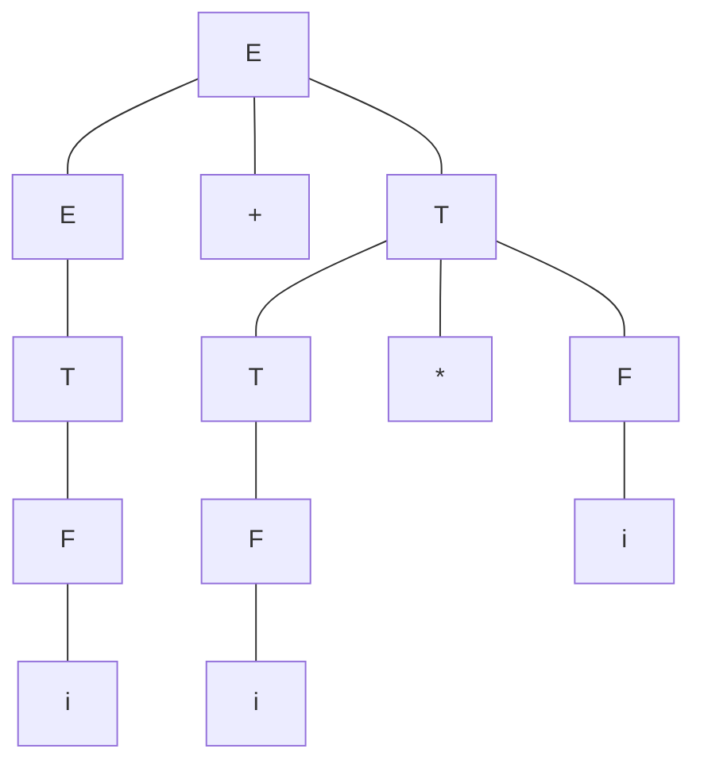

# 程序语言的语法描述
## 概念
- 空字$\epsilon$
- 有穷字母表$\Sigma$
- $V$自身的n次连接$V^n = VV...V$一共n个$V$
- 规定$V^0 = $ {$\epsilon$}

## 定义
编译原理 = 形式语言理论 + 编译技术
形式语言理论 = 文法 + 自动机

## 形式语言
- 通过人们公认的符号、表达方式所描述的一种语言，是一种通用语言，没有国籍之分。
- 形式语言是某个字母表上的字符串的集合，有一定的描述范围

## 文法
### 定义
所谓文法是用来定义语言的一个**数学模型**
### 形式定义
四元组$G = (V_N, V_T, S, \pounds)$
- $V_N$非终结符的*有限集合*
  - 非终结符一般大写字母，还能推出其他东西
- $V_T$终结符的*有限集合*
  - 一般小写字母或0-9或运算符号，**推不出其他东西**
- $S$开始符号且$S \in V_N$(非终结符)，第一个产生式中出现
- $\pounds$形式为$P \rightarrow \alpha$的产生式的*有限集合*
  - $P \in (V_N \cup V_T)^*V_N(V_N \cup V_T)^*$(即在左边的至少有一个非终结符)
  - $\alpha \in (V_N \cup V_T)^*$
  - 若干个左边相同的可以合并右边用`|`分割：$P \rightarrow \alpha_1 | \alpha_2 |...|\alpha_n $，每个$\alpha_n$成为$P$的一个*候选式*

### 简化表示
- 只写出产生式部分
- 约定第一个产生式的左部符号为初始符号或在产生式前写上“G[A]”，其中G为文法名，A为初始符号
- 示例
  - 文法G[N]: N→0N, N→1N, N→0, N→1
  - 文法G[E]: E→E+E│E*E│(E)│i
  
## 从文法到句子到语言
### 基本思想
从识别符号开始，把当前产生的符号串中的非终结符号替换为相应产生式右部的符号串，直到最终全由终结符号组成。这种替换过程称为推导或产生句子的过程，每一步称为**直接推导**或**直接产生**

### 直接推导/规约
如果$A \rightarrow \gamma$是一个产生式，而$\alpha$、$\beta$ $\in (V_T \cup V_N)^*$，则将产生式$A \rightarrow \gamma$用于符号串$\alpha A \beta$得到的符号串$\alpha \gamma \beta$，记为$\alpha A \beta \Rightarrow \alpha \gamma \beta$，称为直接推导

而其逆过程即为直接规约

### 推导/规约
- $\alpha_1 \Rightarrow^+ \alpha_n$经一步或若干步推导
- $\alpha_1 \Rightarrow^* \alpha_n$经零步或若干步推导
- 若在推导关系中，每次最先替换最左（右）的**非终结符**，则称为**最左（右）推导**
- 若在归约过程中，每次最先归约最左（右）的**非终结符**，则称为**最左（右）归约**

### 分类
文法G[E]: E→E+E│E*E│(E)│i

- 句型：假定G是一个文法，E是它的开始符号，如果$E \Rightarrow^* \alpha$，则称$\alpha$是文法G的一个句型
  - (E+E),(i+E),(i+i),E都是G[E]的句型
- 句子：**仅由终结符**组成句型成为句子
  - (i*i+i),(i+i)都是G[E]的句子
- 语言：文法G所产生的句子的全体
  - $L(G) = \{\alpha | S \Rightarrow^+ \alpha, \alpha \in V_T^*\}$

### 推导举例
G1[S]: S →bA , A→aA | a
$S \Rightarrow bA \Rightarrow ba$
$S \Rightarrow baA \Rightarrow baa$
$S \Rightarrow baA \Rightarrow baaA \Rightarrow baaa$
所以$L(G1)=\{ba^n|n>=1\}$

设文法G2[S] ：S→ AB, A →aA|a, B →bB|b
$S \Rightarrow AB \Rightarrow ab$
$S \Rightarrow AB \Rightarrow aAB \Rightarrow aaB \Rightarrow aab$
所以$L(G2)=\{a^mb^n|m,n>=1\}$

# 分类
3 $\in$ 2 $\in$ 1 $\in$ 0
## 0型文法
- 无限制文法、短语文法
- 递归和枚举语言
- 图灵机
- 示例
  - $S \rightarrow aBC|aSBC$
  - $CB \rightarrow BC$
  - $aB \rightarrow ab$
  - $bB \rightarrow bb$
  - $cC \rightarrow c$
## 1型文法
- 上下文有关文法CSG(Context-sensitive Grammer)
- **右边的长的不能少于左边**
- 上下文有关语言CSL(Context-sensitive Language)
- 线性有界自动机LBA(Linear Bounded Automation)
- 示例
  - $S \rightarrow aBC|aSBC$
  - $CB \rightarrow BC$  
  - $aB \rightarrow ab$
  - $bB \rightarrow bb$
## 2型文法
- 上下文无关文法CFG(Context-free Grammer)
- 左边只有一个
- 上下文无关语言CFL(Context-free Language)
- 下推自动机PDA(Pushdown Automation)
- 示例
  - $S \rightarrow 01$
  - $S \rightarrow 0S1$
## 3型文法
- 正规文法
- 右线性文法(Right-linear Grammer)
  - $A \rightarrow \omega B$or$A -> \omega$，其中$A、B \in V_N$，$\omega \in V_T^*$
  - $A \rightarrow B \omega$or$A -> \omega$，其中$A、B \in V_N$，$\omega \in V_T^*$
  - 正规式
  - 正规语言
  - 有限自动机

# 语法树

# 二义性
## 有歧义
$E \rightarrow E * E$
$E \rightarrow E + E$
$E \rightarrow i$

随便找一个反例$i + i * i$
有两种语法树，优先级就不能确定

## 没有歧义
$E \rightarrow E + T$
$E \rightarrow T$
$T \rightarrow T * F$
$T \rightarrow F$
$F \rightarrow i$

