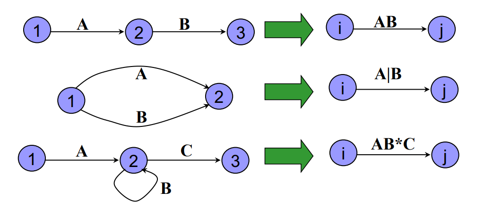
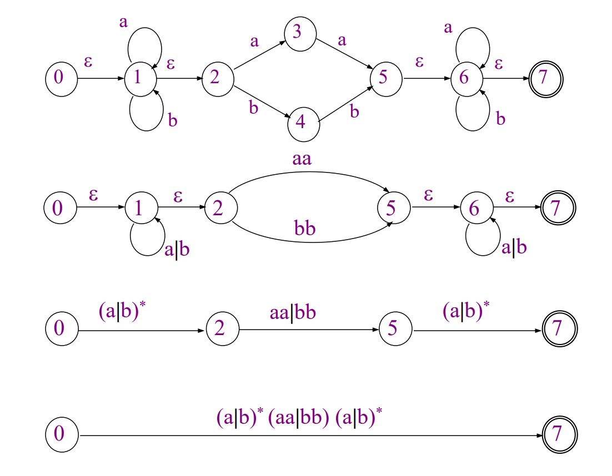
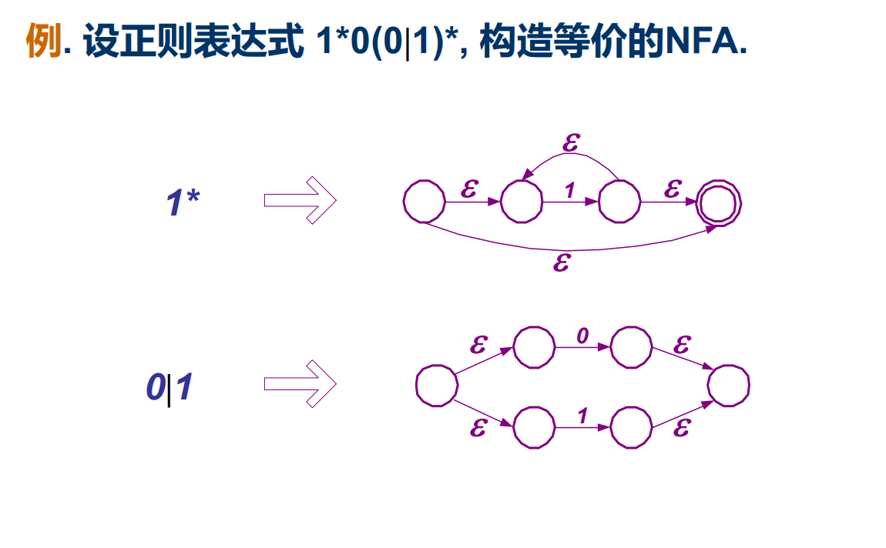
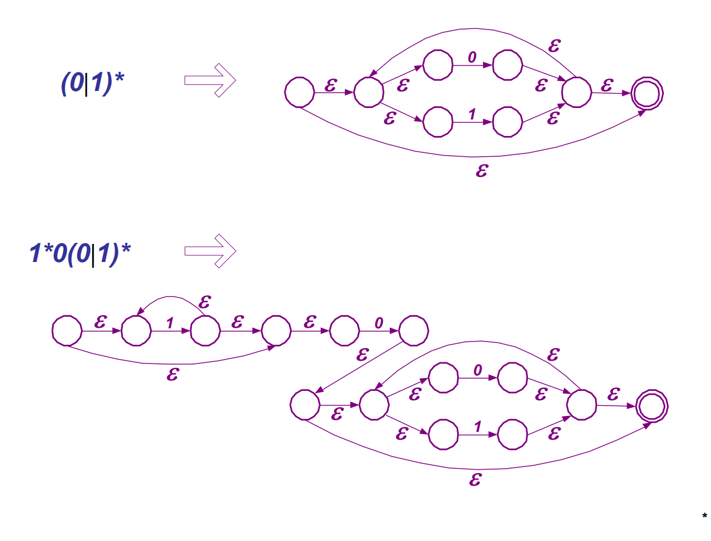

# 词法分析
[正规式转换为DFA](https://blog.csdn.net/C2681595858/article/details/85262797)

## 构造思路
词法规则 $\rightarrow$ 正规式 $\rightarrow$ NFA $\rightarrow$ DFA $\rightarrow$ 化简 $\rightarrow$ 词法分析器(Scanner)

我们做到正规式就好了，剩下的交给程序做

## 正规式与正规集
正规式是一个pattern
正规集是符合这个正规式的所有字符串的集合

字母表$\Sigma$上的正规式和正规集递归定义如下
1. $\epsilon$和$\phi$都是$\Sigma$上的正规式，它们所表示的正规集分别为{$\epsilon$}和$\phi$。其中：**$\epsilon$为空字符串，$\phi$为空集**
2. 任意元素$a \in \Sigma$，$a$是$\Sigma$上的一个正规式，它所表示的正规集是{$a$}
3. 假定$U$和$V$都是$\Sigma$上的正规式，它们所表示的正规集记为$L(U)$和$L(V)$，那么$U|V$，$(U·V)$和$(U)^*$都是正规式，他们所表示的正规集分别记为$L(U) \cup L(V)$，$L(U)L(V)$和$(L(U))^*$
4. 仅由有限次使用上述三步而得到的表达式才是$\Sigma$上的正规式，它们所表示的字集才是$\Sigma$上的正规集

### 运算示例
#### $\cup$
$L = \{ 001, 10, 111\}$, $M = \{ \epsilon, 001 \}$
则$L \cup M = \{ \epsilon, 10, 001, 111 \}$
#### 连接
类似笛卡尔积，注意有前后顺序
$L = \{ 001, 10, 111\}$, $M = \{ \epsilon, 001 \}$
则$LM = \{ 001, 10, 111, 001001, 10001, 111001 \}$
#### $*$
不用管顺序的随便顺序组合
$L = \{ 0, 11 \}$
则$L^* = \{ \epsilon, 0, 11, 011, 110, 1111, 000, 0011, 0110, 01111, 1100, 11011, 11110, 11111, ... \}$

### 运算规则
先闭包再连接然后再|
若两个正规式所表示的正规集相同，则认为二者等价，记为$U=V$

### 示例
#### 1
正规式
$(a|b)(a|b)$
正规集
$L(a|b)(a|b)$
$=L(a|b)L(a|b)$
$=(L(a) \cup L(b)) (L(a) \cup L(b))$
$=\{ a, b \} \{ a, b \}$
$=\{ aa, ab, ba, bb \}$

**或可以转换成$\cup$**

#### 2
正规式
$a(a|b)^*$
正规集
$\Sigma$上所有以a为首的字集

#### 3
正规式
$(0|1|2|...|9)(0|1|2|...|9)^*$
正规集
整数

但是会存在0005这样
于是我们把零单独拿出来
$(1|2|...|9)(0|1|2|...|9)^*|0$

#### 4
正规式
$(A|B|...Z|a|b|...|z)(A|B|...Z|a|b|...|z|0|1|2|...|9)^*$
正规集
C语言中的标识符

#### 5
以01结尾的二进制数串
$(0|1)^*01$

#### 6
能被5整除的整数
$(0|1|2|..|9)^*(5|0)$

#### 7
包含奇数个0的二进制数串
利用$(AA)*A$保证A出现奇数次
$ ((1*01*)(1*01*))*(1*01*)$

### 运算律
- $U|V = V|U$
- $U|(V|W) = (U|V)|W$
- $U(VW) = (UV)W$
- $U(V|W) = UV|UW$
- $(V|W)U = VU|WU$
- $\epsilon U = U \epsilon = U$

## 自动机
### 什么是自动机
- 具有离散输入输出的数学模型
- 自动机接受一定的输入，执行一定的动作，产生一定的结果。使用状态迁移描述整个工作过程。
  - 状态：一个标识，能区分自动机在不同时刻的状况。有限状态系统具有**任意有限数目的内部状态**
### 为什么叫自动机
**可能的状态、运行的规则**都是事先确定的。一旦开始运行，就**按照事先确定的规则工作**，因此叫“自动机”
### 自动机的本质
- 根据状态、输入和规则决定下一个状态
- **状态 ＋ 输入＋ 规则 $\rightarrow$ 状态迁移**

### 有限自动机
FA(Finite Automata)
又叫有限状态机FSM(Finite State Machine)
一个控制器读一条输入带上的字符

#### 确定有限自动机
DFA是一个五元组$M=(S, \Sigma, \delta, s_0, F)$
- $S$: 有限的状态集合，每个元素称为一个**状态** 圆圈；
- $\Sigma $ : 有限的输入字母表，每个元素称为一个**输入字符**；
- $\delta$: 转换函数(状态转移集合): $s \times \Sigma \rightarrow S$ ；
- $s_0$: 初始状态， $s_0 \in S$ ；
- $F$: 终止状态集$F \subseteq S$,  双圆圈；

**状态转换矩阵**
一个DFA可以用一个矩阵表示，行表示状态，列表表示输入字符，矩阵元素表示$\delta(s,a)$，即状态$s$经过条件$a$可以去到的状态

例如：$M = (\{ 0, 1, 2, 3 \}, \{a, b\}, \delta, 0, \{3\})$

|状态|a|b|
|:--:|:--:|:--:|
|0|1|2|
|1|3|2|
|2|1|3|
|3|3|3|

**状态转换图**
整张图有唯一的一个初态结点和若干终态结点

又是初态又是终态 则说明可以接受空字符

**扩展转移函数**
递归的转移函数
$\delta ^{'} (s, \omega a) = \delta(\delta ^{'} (s, \omega), a)$

例如
$\delta(1, a) = 2$
$\delta(2, b) = 3$
那么
$\delta ^{'} (1, ab) = 3$

**DFA接受的语言**
- 被DFA接收的字符串: 输入结束后使DFA的状态到达**终止状态**。否则该字符串不能被DFA接收.
- DFA接收的语言: 被DFA接收的字符串的集合,$L(M) = \{ \alpha | \delta ^{'}(s_0, \alpha) \in F \}$

#### 非确定有限自动机
NFA具有在**同一情况下可有不同选择的能力**。则称为非确定的有限自动机
经过同一个条件可以去不同的状态，下一个状态不确定

包括的确定有限自动机

$M=(S, \Sigma, \delta, S_0, F)$
- $S$: 有限的状态集合，每个元素称为一个**状态** 圆圈；
- $\Sigma $ : 有限的输入字母表，每个元素称为一个**输入字符**；
- $\delta$: 转换函数(状态转移集合): $s \times \Sigma \rightarrow 2^S$ 转移的结果变成集合了；
- $S_0$: 初始状态， $S_0 \in S$ ；
- $F$: 终止状态集$F \subseteq S$,  双圆圈；

#### 等价性
- DFA是NFA的特例，所以NFA必然能接收DFA能接收的语言。
- 一个NFA所能接收的语言能被另一个DFA所接收?
- 设一个NFA接受语言L，那么存在一个DFA接受L。
- 证明策略:对于任意一个NFA，构造一个接收它所能接收语言的DFA，这个DFA的状态对应了NFA的状态集合

## 转换
### NFA到正规式
状态消去法

### 正规式到NFA
Thompson算法
弄出来的是计算机用的的，人弄出来的没有那么多$\epsilon$
做题就很简单的

## 子集构造法
- 第一个I是起点经过任意个$\epsilon$能到的集合
- 之后都是$\epsilon - closure(move(A, a))$

|操作 | 描述 |
| :--: | :--: |
| $\epsilon - closure(s)$ | 能够从NFA状态s开始只通过转换到达的NFA状态集合 |
| $\epsilon - closure(T)$ |能够从T中某个NFA状态s开始只通过$\epsilon$转换到达的NFA状态集合
 $move(T,a)$ | 能够从T中某个状态s出发通过标号为a的转换到达的NFA状态的集合|

