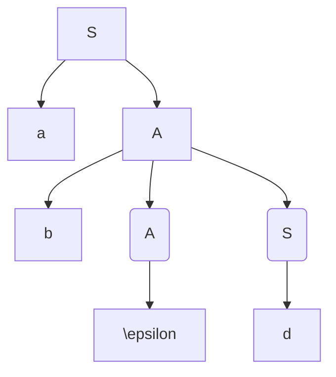

# 语法分析——自上而下
- 从文法的开始符号出发，反复使用各种产生式，寻找与输入符号匹配的最左推导
- 从⽂法的开始符号出发，向下推导，推出句⼦
- 对任何的输入串(单词符号)，试图⽤**⼀切可能的办法**, 从⽂法的开始符号出发，⾃上⽽下地为输入串建⽴⼀棵语法树，即为输入串寻找⼀个最左推导，本质上是一个个试探，效率低代价高

## 问题
- 如果含有**左递归**就会无限循环(因为最左推导)
- 虚假匹配问题
- 回溯引起时间空间大量消耗
- 不成功的时候不知道出错的确切位置
- 
## 分类
### LL(1)分析法
从左(Left)到右扫描输入串，构造最左(Leftmost)推导，分析时每步向前看⼀个(1)字符
文法要求
- 不含左递归
- 对每个非终结符的候选式，其任何推导的头符号(终结符)集合两两不相交(不回溯)

#### 消除左递归
[csdnRef](https://blog.csdn.net/qq2071114140/article/details/102787831)
左递归文法
- 直接递归$A \rightarrow A\beta$
- 间接递归$A \rightarrow B\beta$和$B \rightarrow A\alpha$

如果一个文法是左递归时，就i不能采用自顶向下分析法

我们改写
$P \rightarrow P\alpha|\beta$ ($\alpha \neq \epsilon$, $\beta$不以$P$开头)

转换！
$P \rightarrow \beta P^{'}$
$P^{'} \rightarrow \alpha P^{'}|\epsilon$
把递归弄到右边，右边的递归进入点$P$去掉，先取后面的跟上新的递归进入点，然后取写一个新的递归和$\epsilon$

**例如**
$E \rightarrow E + T | T$
转换！
$E \rightarrow TE^{'}$
$E^{'} \rightarrow +TE^{'}|\epsilon$

如果是间接左递归，先排序，但顺序不重要，生成一个直接递归
$S \rightarrow Qc|c$
$Q \rightarrow Rb|b$
$R \rightarrow Sa|a$

变成直接递归，变一个就好
$S \rightarrow Qc|c$
$Q \rightarrow Rb|b$

**这里注意**
$S$首先可以代入$Qc$和$c$
$R \rightarrow Qca|ca|a$
$Q$然后可以代入$Rb$和$b$
$R \rightarrow Rbca|bca|ca|a$

然后消除左递归
这里相当于$\beta$有三个
$R \rightarrow bcaR^{'}|caR^{'}|aR^{'}$
$R^{'} \rightarrow bcaR^{'}|\epsilon$

$A \rightarrow aB$
$A \rightarrow Bb$
$B \rightarrow Ac$
$B \rightarrow d$

先转换为直接递归，注意这里只有两个因此可以合并为一个
$A \rightarrow aAc|ad|Acb|db$
然后只用管$A$在左边的
$A \rightarrow (aAc|ad|db)A^{'}$
$A^{'} \rightarrow cbA^{'}|\epsilon$

#### 回溯
##### 回溯的原因
若当前符号为 $a$，下一步要展开$A$，而$A \rightarrow \alpha_1|\alpha_2|...|\alpha_n$，应该选择哪一个呢
如果出现了多个以$a$开头的，就会出现回溯，应该变换文法

例如
- 文法
$S \rightarrow xAy$
$A \rightarrow **|*$
- 句子
x*y、x**y

##### 不回溯的条件
对每个非终结符的候选式，任何推到的头符号(终结符)集合两两不相交

##### 解决方法
提取公共左因子
$A \rightarrow \delta \beta_1|\delta \beta_2|...|\delta \beta_n|...|Y_1|Y_2|Y_3|...|Y_m$(其中$Y_1/Y_2/.../Y_m$都不以$\delta$开头)
转换！
$A \rightarrow \delta A^{'}|Y_1|Y_2|...|Y_m$
$A^{'} \rightarrow \beta_1|\beta_2|...|\beta_n$

例子
文法: $S \rightarrow aSb|aS|\epsilon$
先提取有公共左因子的
$S \rightarrow aS(b|\epsilon)$
$S \rightarrow \epsilon$
引入新的符号
$S \rightarrow asA$
$A \rightarrow B|\epsilon$(引入A)
$S \rightarrow \epsilon$(不用变)

文法：$S \rightarrow abc|abd|ae$
**先提取最少的**
$S \rightarrow a(bc|bd|e)$
引入新的符号
$S \rightarrow aA$
$A \rightarrow bc|bd|e$
发现还有，重复上述步骤，提取
$A \rightarrow b(c|d)$
$A \rightarrow e$
引入新符
$A \rightarrow bB$
$B \rightarrow c|d$
综上
$S \rightarrow aA$
$A \rightarrow bB$
$B \rightarrow c|d$
$A \rightarrow e$

##### 判断方法
对于符号串(终结符和非终结符的组合)$\alpha$的终结首符集FIRST($\alpha$)定义为$$FIRST(\alpha) = \{a| \alpha \Rightarrow^{*} a..., a \in V_T \}$$
$\Rightarrow^{*}$是任意步能推出

若$a \Rightarrow \epsilon$说明$\epsilon \in FIRST(\alpha)$

条件可以表示为：对文法的任一非终结符号$A$，若$A \rightarrow \alpha_1|\alpha_2|...|\alpha_n$，则应有$FIRST(\alpha_i) \cap FIRST(\alpha_j) = \varnothing, i \neq j$

**$FIRST(X)$计算方法**
$X$**一个**非终结符或者终结符
- $X \in V_T$则$FIRST(X) = \{X\}$(终结符的终结首符集就是自己)
- $X \in V_N$则$FIRST(X) = \{a| \alpha \Rightarrow^{*} a..., a \in V_T \}$(非终结符的就是经过任意步骤能推出的符号串的第一个)
- $X \in V_N$且有产生式$X \rightarrow \epsilon$则$\{ \epsilon \} \in FIRST(X)$(如果能推出$\epsilon$，那么$\epsilon$也在集合中)
- $X \in V_N$且有产生式$X \rightarrow Y_1Y_2...Y_n$且$Y_1Y_2...Y_n \in V_N$(推出一串非终结符)
  - 当$Y_1, Y_2, ..., Y_{i-1} \Rightarrow^{*} \epsilon$则$FIRST(Y_1) - \{\epsilon\}$，$FIRST(Y_2) - \{\epsilon\}$ ... $FIRST(Y_{i-1}) - \{\epsilon\}$, $FIRST(Y_i)$ 都包含在$FIRST(X)$中(这一串非终结符**除了最后一个**都能推出$\epsilon$，则除了最后一个的所有集合去掉$\epsilon$和最后一个的集合都属于$FIRST(X)$)
  - 当$Y_i \Rightarrow^{*} \epsilon(i=1,2,...,n)$，将$\{\epsilon\}$并入$FIRST(X)$中(所有的都能推出$\epsilon$才能把$\epsilon$加入$FIRST(X)$)

例子文法G
$E \rightarrow TE^{'}$
$E^{'} \rightarrow +TE^{'}|\epsilon$
$T \rightarrow FT^{'}$
$T^{'} \rightarrow *FT^{'}|\epsilon$
$F \rightarrow (E)|i$

$FIRST(E) = FISRT(T) = FIRST(F) = \{(,i\}$
$FIRST(E^{'}) = \{+, \epsilon\}$
$FISRT(T^{'}) = \{*,\epsilon\}$

但如果$T \rightarrow FT^{'}|\epsilon$
变为$FIRST(E) = FISRT(T) = \{(,i,\epsilon\}$

**$FIRST(\alpha)$构造**
对于符号串$\alpha = X_1X_2...X_n$
- 置$FIRST(\alpha) = FIRST(X_1) - \{\epsilon\}$
- 若对所有$X_j, 1 \le j \le i-1, \epsilon \in FIRST(X_j)$则把$FIRST(X_j) - \{\epsilon\}$加到$FIRST(\alpha)$中(前面一串没到末尾的$\epsilon$只能集合减去$\epsilon$)
- 若对所有的$X_j, 1 \le j \le n, \epsilon \in FIRST(X_j)$则把$\epsilon$加到$FIRST(\alpha)$中(所有都能$\epsilon$才加入$\epsilon$)

**引出第二个条件FOLLOW**的例子
$G \rightarrow aA|d$
$A \rightarrow bAS|\epsilon$

判断符号串abd是否为句子

这是因为$A$有产生式$A \rightarrow \epsilon$,而从开始符号$S$可以得出$S \Rightarrow^{*} ...Ad...$

这样子会让我们以为不能生成一个句子，因为指针走到$d$这时候$\epsilon$&$b$都不相等，但其实是可以推出这个句子的

**FOLLOW集合**
设$S$是文法$G$的开始符号，对$G$的任何非终结符$A$，定义$A$的后继终结符号集为
$$FOLLOW(A) = \{ a | S \Rightarrow^{*} ...Aa..., a \in V_T\}$$
特别地，若$S \Rightarrow^{*} ...A$，则规定$$\# \in FOLLOW(A)$$
$FOLLOW(A)$是所有句型中出现在紧接A之后的终结符或“＃”

**FOLLOW(A)的构造**
对于文法$G$的每个非终结符，构造$FOLLOW(A)$的方法是
- 若$A$为文法**开始符号**，置$\#$于$FOLLOW(A)$中
- 若有产生式$B \rightarrow \alpha A \beta$，则$FIRST(\beta) - \{\epsilon\}$加到$FOLLOW(A)$
- 若有$B\rightarrow \alpha A$或$B \rightarrow \alpha A \beta, 且$\beta \Rightarrow^{*} \epsilon$则将$FOLLOW(B)$加到$FOLLOW(A)$中
- 反复上述规制直到$FOLLOW(A)$不再扩大

例子
$E \rightarrow TE^{'}$
$E^{'} \rightarrow +TE^{'}|\epsilon$
$T \rightarrow FT^{'}$
$T^{'} \rightarrow *FT^{'}|\epsilon$
$F \rightarrow (E)|i$

$FOLLOW(E) = \{\#,)\}$开始符号有$\#$，$F \rightarrow (E)|i$ 有$)$
$FOLLOW(E^{'}) = FOLLOW(E) = \{\#,)\}$因为$E \rightarrow TE^{'}$第三条
$FOLLOW(T)$顺序使用上面第二、三条，首先加入$FIRST(E^{'})$，然后加入$FOLLOW(E^{'})$，根据$E \rightarrow TE^{'}$
$FOLLOW(T^{'}) = FOLLOW(T) = { +, \#, )}$根据$T \rightarrow FT^{'}$第三条
$FOLLOW(F) = \{*, +, \#, )\}$，加入$FOLLOW(F^{'})$和$FIRST(T^{'})$

### 递归下降分析法

### 预测分析法