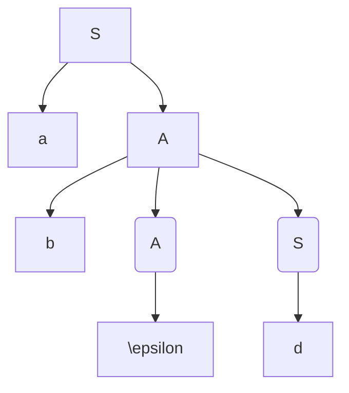
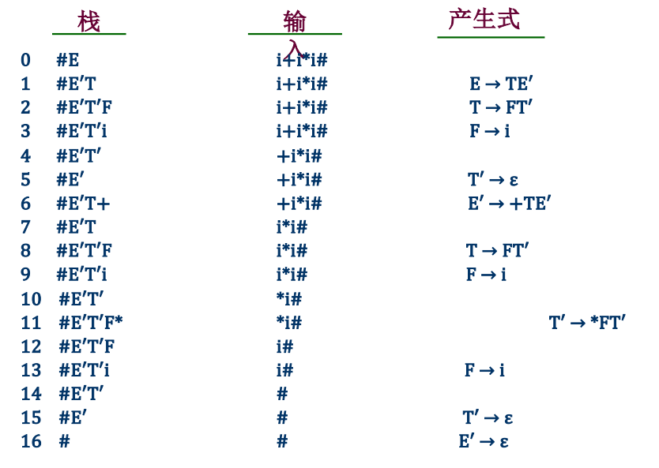

[TOC]
# 语法分析——自上而下
- 从文法的开始符号出发，反复使用各种产生式，寻找与输入符号匹配的最左推导
- 从⽂法的开始符号出发，向下推导，推出句⼦
- 对任何的输入串(单词符号)，试图用**一切可能的办法**, 从文法的开始符号出发，自上而下地为输入串建立⼀棵语法树，即为输入串寻找⼀个最左推导，本质上是一个个试探，效率低代价高

## 问题
- 如果含有**左递归**就会无限循环(因为最左推导)
- 虚假匹配问题
- 回溯引起时间空间大量消耗
- 不成功的时候不知道出错的确切位置
 
## 分类
### LL(1)分析法
从左(Left)到右扫描输入串，构造最左(Leftmost)推导，分析时每步向前看⼀个(1)字符
文法要求
- 不含左递归
- 文法每一个非终结符$A$的任何两个不同产生式$A \rightarrow \alpha | \beta$，有$FIRST(\alpha) \cap  FIRST(\beta) = \varnothing$
- 文法每一个非终结符$A$，若$A \Rightarrow^{*} \epsilon$则$FIRST(A) \cap FOLLOW(A) = \varnothing$


#### 消除左递归
[csdnRef](https://blog.csdn.net/qq2071114140/article/details/102787831)
左递归文法
- 直接递归$A \rightarrow A\beta$
- 间接递归$A \rightarrow B\beta$和$B \rightarrow A\alpha$

如果一个文法是左递归时，就i不能采用自顶向下分析法

我们改写
$P \rightarrow P\alpha|\beta$ ($\alpha \neq \epsilon$, $\beta$不以$P$开头)

转换！
$P \rightarrow \beta P^{'}$
$P^{'} \rightarrow \alpha P^{'}|\epsilon$
把递归弄到右边，右边的递归进入点$P$去掉，先取后面的跟上新的递归进入点，然后取写一个新的递归和$\epsilon$

**例如**
$E \rightarrow E + T | T$
转换！
$E \rightarrow TE^{'}$
$E^{'} \rightarrow +TE^{'}|\epsilon$

如果是间接左递归，先排序，但顺序不重要，生成一个直接递归
$S \rightarrow Qc|c$
$Q \rightarrow Rb|b$
$R \rightarrow Sa|a$

变成直接递归，变一个就好
$S \rightarrow Qc|c$
$Q \rightarrow Rb|b$

**这里注意**
$S$首先可以代入$Qc$和$c$
$R \rightarrow Qca|ca|a$
$Q$然后可以代入$Rb$和$b$
$R \rightarrow Rbca|bca|ca|a$

然后消除左递归
这里相当于$\beta$有三个
$R \rightarrow bcaR^{'}|caR^{'}|aR^{'}$
$R^{'} \rightarrow bcaR^{'}|\epsilon$

$A \rightarrow aB$
$A \rightarrow Bb$
$B \rightarrow Ac$
$B \rightarrow d$

先转换为直接递归，注意这里只有两个因此可以合并为一个
$A \rightarrow aAc|ad|Acb|db$
然后只用管$A$在左边的
$A \rightarrow (aAc|ad|db)A^{'}$
$A^{'} \rightarrow cbA^{'}|\epsilon$

#### 回溯
##### 回溯的原因
若当前符号为 $a$，下一步要展开$A$，而$A \rightarrow \alpha_1|\alpha_2|...|\alpha_n$，应该选择哪一个呢
如果出现了多个以$a$开头的，就会出现回溯，应该变换文法

例如
- 文法
$S \rightarrow xAy$
$A \rightarrow **|*$
- 句子
x*y、x**y


##### 不回溯的条件
- 文法每一个非终结符$A$的任何两个不同产生式$A \rightarrow \alpha | \beta$，有$FIRST(\alpha) \cap  FIRST(\beta) = \varnothing$
- 文法每一个非终结符$A$，若$A \Rightarrow^{*} \epsilon$则$FIRST(A) \cap FOLLOW(A) = \varnothing$
##### 解决方法
提取公共左因子
$A \rightarrow \delta \beta_1|\delta \beta_2|...|\delta \beta_n|...|Y_1|Y_2|Y_3|...|Y_m$(其中$Y_1/Y_2/.../Y_m$都不以$\delta$开头)
转换！
$A \rightarrow \delta A^{'}|Y_1|Y_2|...|Y_m$
$A^{'} \rightarrow \beta_1|\beta_2|...|\beta_n$

例子
文法: $S \rightarrow aSb|aS|\epsilon$
先提取有公共左因子的
$S \rightarrow aS(b|\epsilon)$
$S \rightarrow \epsilon$
引入新的符号
$S \rightarrow asA$
$A \rightarrow B|\epsilon$(引入A)
$S \rightarrow \epsilon$(不用变)

文法：$S \rightarrow abc|abd|ae$
**先提取最少的**
$S \rightarrow a(bc|bd|e)$
引入新的符号
$S \rightarrow aA$
$A \rightarrow bc|bd|e$
发现还有，重复上述步骤，提取
$A \rightarrow b(c|d)$
$A \rightarrow e$
引入新符
$A \rightarrow bB$
$B \rightarrow c|d$
综上
$S \rightarrow aA$
$A \rightarrow bB$
$B \rightarrow c|d$
$A \rightarrow e$

##### 判断方法
对于符号串(终结符和非终结符的组合)$\alpha$的<font style="color:red;">终结首符集FIRST($\alpha$)</font>定义为$$FIRST(\alpha) = \{a| \alpha \Rightarrow^{*} a..., a \in V_T \}$$
$\Rightarrow^{*}$是任意步能推出

若$a \Rightarrow \epsilon$说明$\epsilon \in FIRST(\alpha)$

条件可以表示为：对文法的任一非终结符号$A$，若$A \rightarrow \alpha_1|\alpha_2|...|\alpha_n$，则应有$FIRST(\alpha_i) \cap FIRST(\alpha_j) = \varnothing, i \neq j$

**$FIRST(X)$计算方法**
$X$**一个**非终结符或者终结符
- $X \in V_T$则$FIRST(X) = \{X\}$(终结符的终结首符集就是自己)
- $X \in V_N$则$FIRST(X) = \{a| \alpha \Rightarrow^{*} a..., a \in V_T \}$(非终结符的就是经过任意步骤能推出的符号串的第一个)
- $X \in V_N$且有产生式$X \rightarrow \epsilon$则$\{ \epsilon \} \in FIRST(X)$(如果能推出$\epsilon$，那么$\epsilon$也在集合中)
- $X \in V_N$且有产生式$X \rightarrow Y_1Y_2...Y_n$且$Y_1Y_2...Y_n \in V_N$(推出一串非终结符)
  - 当$Y_1, Y_2, ..., Y_{i-1} \Rightarrow^{*} \epsilon$则$FIRST(Y_1) - \{\epsilon\}$，$FIRST(Y_2) - \{\epsilon\}$ ... $FIRST(Y_{i-1}) - \{\epsilon\}$, $FIRST(Y_i)$ 都包含在$FIRST(X)$中(这一串非终结符**除了最后一个**都能推出$\epsilon$，则除了最后一个的所有集合去掉$\epsilon$和最后一个(也可以能是一大坨的第一个)的集合都属于$FIRST(X)$)
  - 当$Y_i \Rightarrow^{*} \epsilon(i=1,2,...,n)$，将$\{\epsilon\}$并入$FIRST(X)$中(所有的都能推出$\epsilon$才能把$\epsilon$加入$FIRST(X)$)

例子文法G
$E \rightarrow TE^{'}$
$E^{'} \rightarrow +TE^{'}|\epsilon$
$T \rightarrow FT^{'}$
$T^{'} \rightarrow *FT^{'}|\epsilon$
$F \rightarrow (E)|i$

$FIRST(E) = FISRT(T) = FIRST(F) = \{(,i\}$
$FIRST(E^{'}) = \{+, \epsilon\}$
$FISRT(T^{'}) = \{*,\epsilon\}$

但如果$T \rightarrow FT^{'}|\epsilon$
变为$FIRST(E) = FISRT(T) = \{(,i,\epsilon\}$

**$FIRST(\alpha)$构造**
对于符号串$\alpha = X_1X_2...X_n$
- 置$FIRST(\alpha) = FIRST(X_1) - \{\epsilon\}$
- 若对所有$X_j, 1 \le j \le i-1, \epsilon \in FIRST(X_j)$则把$FIRST(X_j) - \{\epsilon\}$加到$FIRST(\alpha)$中(前面一串没到末尾的$\epsilon$只能集合减去$\epsilon$)
- 若对所有的$X_j, 1 \le j \le n, \epsilon \in FIRST(X_j)$则把$\epsilon$加到$FIRST(\alpha)$中(**所有都能$\epsilon$才加入$\epsilon$**)

**引出第二个条件FOLLOW**的例子
$G \rightarrow aA|d$
$A \rightarrow bAS|\epsilon$

判断符号串abd是否为句子

这是因为$A$有产生式$A \rightarrow \epsilon$,而从开始符号$S$可以得出$S \Rightarrow^{*} ...Ad...$

这样子会让我们以为不能生成一个句子，因为指针走到$d$这时候$\epsilon$&$b$都不相等，即$d$并不在$A$的首符集中，但其实是可以推出这个句子的

这时候就要看$d$是不是它的后继符，如果**是**就将$A$替换成$\epsilon$，这时候就要求每个候选式的后继符集合和自己的首符集也要两两不相交

**FOLLOW集合**
设$S$是文法$G$的开始符号，对$G$的任何非终结符$A$，定义<font style="color: red">$A$的后继终结符号集</font>为
$$FOLLOW(A) = \{ a | S \Rightarrow^{*} ...Aa..., a \in V_T\}$$
特别地，若$S \Rightarrow^{*} ...A$，则规定$$\# \in FOLLOW(A)$$
$FOLLOW(A)$是所有句型中出现在紧接A之后的终结符或$\#$

这里FOLLOW集合是不讨论空字的，因为指针指到某个符号还没检测完，不应该是空字也不可能有空字

**FOLLOW(A)的构造**
对于文法$G$的每个非终结符，构造$FOLLOW(A)$的方法是
- 若$A$为文法**开始符号**，置$\#$于$FOLLOW(A)$中
- 若有产生式$B \rightarrow \alpha A \beta$，则$FIRST(\beta) - \{\epsilon\}$加到$FOLLOW(A)$
- 若有$B\rightarrow \alpha A$或$B \rightarrow \alpha A \beta$, 且$\beta \Rightarrow^{*} \epsilon$则将$FOLLOW(B)$加到$FOLLOW(A)$中(注意这个$\beta$可以是非终结符和终结符都可以)
- 反复上述规制直到$FOLLOW(A)$不再扩大

例子
$E \rightarrow TE^{'}$
$E^{'} \rightarrow +TE^{'}|\epsilon$
$T \rightarrow FT^{'}$
$T^{'} \rightarrow *FT^{'}|\epsilon$
$F \rightarrow (E)|i$

$FOLLOW(E) = \{\#,)\}$开始符号有$\#$，$F \rightarrow (E)|i$ 有$)$
$FOLLOW(E^{'}) = FOLLOW(E) = \{\#,)\}$因为$E \rightarrow TE^{'}$第三条
$FOLLOW(T)$顺序使用上面第二、三条，首先加入$FIRST(E^{'}) - \{\epsilon\}$，然后加入$FOLLOW(E^{'})$(因为$E^{'}$还可以推出$\epsilon$)，根据$E \rightarrow TE^{'}$
$FOLLOW(T^{'}) = FOLLOW(T) = { +, \#, )}$根据$T \rightarrow FT^{'}$第三条
$FOLLOW(F) = \{*, +, \#, )\}$，加入$FOLLOW(F^{'})$和$FIRST(T^{'})$

#### LL(1)分析方法
对一个LL(1)文法，可以对某个输入串进行有效的无回溯的自上而下分析

输入符号位$a$，要用非终结符$A$进行匹配，且$A \rightarrow \alpha_1|\alpha_2|...|\alpha_n$，则可以如下分析
- 若$a \in FIRST(\alpha_i)$，则指派$\alpha_i$执行匹配任务
- 否则
  - 若$\epsilon \in FIRST(A)$，且$\alpha \in FOLLOW(A)$，则让$A$与$\epsilon$匹配
  - 否则出现语法错误

### 递归下降分析法
#### 条件
满足LL(1)文法的条件
#### 构成
一组递归过程
每个递归过程对应G的一个**非终结符**
#### 基本思想
从文法的开始符号出发，在语法规则(文法产生式)的支配下，进行语法分析。逐个扫描源程序中的字符(单词符号)，根据文法和当前输入字符分析到下一个语法成分A时，便调用识别和分析A的子程序(或其自身)，如此继续下去。

#### 程序形式
- 对于每一个非终结符$A$，编写一个相应的子程序`P(A)`
- 对于规则$A \rightarrow \alpha_1|\alpha_2|...|\alpha_n$相应的子程序`P(A)`构造如下:
    ```
    IF ch IN FIRST(\alpha_1) THEN P(\alpha_1)
    ELSE IF ch IN FIRST(\alpha_2) THEN P(\alpha_2)
    ELSE ...
    ELSE IF ch IN FIRST(\alpha_n) THEN P(\alpha_n)
    ELSE IF (\epsilon \in FIRST(A) AND ch IN FOLLOW(A))
      THEN RETURN
    ELSE ERROR
    ```
    **注意$FIRST$里面的是右边每个候选式**
    **$FOLLOW$里面的是左部**
- 对于符号串$\alpha = Y_1Y_2...Y_m$相应的子程序$P(\alpha)$为:
    ```
    BEGIN
      P(Y_1)
      P(Y_2) 
      ...
      P(Y_n) 
    END
    ```
  - 如果$Y_i \in V_T$(终结符)，则$P(Y_i)$为
    ```
    IF ch = Y_i THEN read(ch)
    ELSE ERROR
    ```
  - 如果$Y_i \in V_N$(非终结符)，则$P(Y_i)$为上述中相应的子程序

**例子**

$E \rightarrow TE^{'}$
$E^{'} \rightarrow +TE^{'} | \epsilon$
$T \rightarrow FT^{'}$
$T^{'} \rightarrow *FT^{'} | \epsilon$
$F \rightarrow (E)|i$

实际写的时候就`IF ch IN {i} THEN`，用集合代替这个$FIRST(...)$
```
// P(E)
IF ch IN FIRST(TE') THEN
  P(T)
  P(E')
ELSE \epsilon IN FIRST(E) AND ch IN FOLLOW(E) THEN
  return
ELSE ERROR
```
```
//P(E')
IF ch IN FIRST(+TE') THEN
  read(ch)  // 可以直接read了因为上面判断过
            // 但是如果之后还有终结符就需要用if-else判断了
  P(T)
  P(E')
ELSE IF \epsilon IN FIRST(E') AND ch IN FOLLOW(E') THEN
  return
ELSE ERROR
```

```
// P(T)
IF ch IN FIRST(FT') THEN
  P(F)
  P(T')
ELSE IF \epsilon IN FIRST(T) AND ch IN FOLLOW(T) THEN
  return
ELSE ERROR
```

```
// P(T')
IF ch IN FIRST(*FT') THEN
  IF ch = '*' THEN
    read(ch)
  ELSE ERROR
  P(F)
  P(T')
ELSE IF \epsilon IN FIRST(T') AND ch IN FOLLOW(T') THEN
  return
ELSE ERROR
```

```
// P(F)
IF ch IN FIRST((E)) THEN
  IF ch = '(' THEN 
    read(ch)
  ELSE ERROR
  P(E)
  IF ch = ')' THEN
    read(ch)
  ELSE ERROR
ELSE IF ch = 'i' THEN
  read(ch)
ELSE \epsilon IN FIRST(F) AND ch IN FOLLOW(F) THEN
  return
ELSE ERROR
```


#### 局限性
需要具有能够实现递归过程的语言和编译系统


else 那里判断是否为其后继符，指针不后移直接RETURN

**写程序必考**

### 预测分析法

使用一个**分析表**和**符号栈**进行联合控制

#### 基本思想
根据输入串的当前**输入符**确定**选用某一个产生式**进行推导，当该输入符与推导的第一个符号相同时，再取输入串的下一个符号，继续确定下一个推导应选的产生式，如此下去，直到推出被分析的输入串为止

#### 分析器组成
- LL(1)分析表(预测分析表)
  - 若文法有m个非终结符n个终结符，则LL(1)分析表是一个(m+1)*(n+2)的矩阵M，列多了一个$\#$
  - M[A, a]为⼀条关于A的产⽣式，指出当A⾯临a时，应使⽤的产⽣式或空格(出错标志)
- 符号栈(后进先出)
- 控制程序(表驱动程序)
#### 栈
栈存放分析过程的文法符号
分析开始时候先PUSH一个$\#$，再PUSH文法开始符
当分析栈中只剩下$\#$，且输入串指针指向串尾的$\#$时，分析成功
栈里面的就是还没有匹配的句型
#### 总控程序
根据栈顶符号$x$和当前输入符号$a$，查表决定分析器的动作
- 若$x = a = '\#'$，栈顶和输入符号都是$\#$结束！分析成功！
- 若$x = a \neq '\#'$，栈顶符号和输入符号匹配，x出栈POP，输入串指针后移，读入下一个符号存入a，继续对下一个字符进行分析
- 若$x$为非终结符$A$，则查分析表$M[A, a]$
  - 若$M[A, a]$为产生式，则$A$出栈POP，$M[A, a]$中产生式的右部逆序入栈PUSH
  - 若$M[A, a]$为$A \rightarrow \epsilon$，则只将$A$出栈POP
  - 若$M[A, a]$为空，则发现语法错误，调用出错处理程序进行处理

#### 例子
$E \rightarrow TE^{'}$
$E^{'} \rightarrow +TE^{'} | \epsilon$
$T \rightarrow FT^{'}$
$T^{'} \rightarrow *FT^{'} | \epsilon$
$F \rightarrow (E)|i$

LL(1)分析表

||$i$|$+$|$*$|$($|$)$|$\#$|
|:--:|:--:|:--:|:--:|:--:|:--:|:--:|
|$E$|$E \rightarrow TE^{'}$|&nbsp;|&nbsp;|$E \rightarrow TE^{'}$|&nbsp;|&nbsp;|
|$E^{'}$|&nbsp;|$E^{'} \rightarrow +TE^{'}$|&nbsp;|&nbsp;|$E^{'} \rightarrow \epsilon$|$E^{'} \rightarrow \epsilon$|
|$T$|$T \rightarrow FT^{'}$|&nbsp;|&nbsp;|$T \rightarrow FT^{'}$|&nbsp;|&nbsp;|
|$T^{'}$|&nbsp;|$T^{'} \rightarrow \epsilon$|$T^{'} \rightarrow *FT^{'}$|&nbsp;|$T^{'} \rightarrow \epsilon$|$T^{'} \rightarrow \epsilon$|
|$F$|$F \rightarrow i$|&nbsp;|&nbsp;|$F \rightarrow (E)$|&nbsp;|&nbsp;|

这张表怎么来的呢
先求出所有的$FIRST$和$FOLLOW$
$FIRST(E) = \{(, i\}$
$FIRST(E^{'}) = \{+, \epsilon\}$
$FIRST(T) = \{(, i\}$
$FIRST(T^{'}) = \{*, \epsilon\}$
$FIRST(F) = \{(, i\}$

首符集中不是$\epsilon$对应着一般的产生式
能推出$\epsilon$的去找它的后继符集合

$FOLLOW(E^{'}) = FOLLOW(E) = \{), \#\}$
$FOLLOW(T^{'}) = FOLLOW(T) = FIRST(E^{'}) - \{\epsilon\} + FOLLOW(E^{'}) = \{+, ), \# \}$

后继符集中的就对应推出$\epsilon$的产生式，直接写，效率高，不管经过多少步

看**指针**的符号是横着的哪个终结符，然后找到对应的**栈顶非终结符/终结符**，即可找到对应的产生式，若没有就不符合语法
注意要**倒序入栈**

对于符号串$i+i*i\#$


