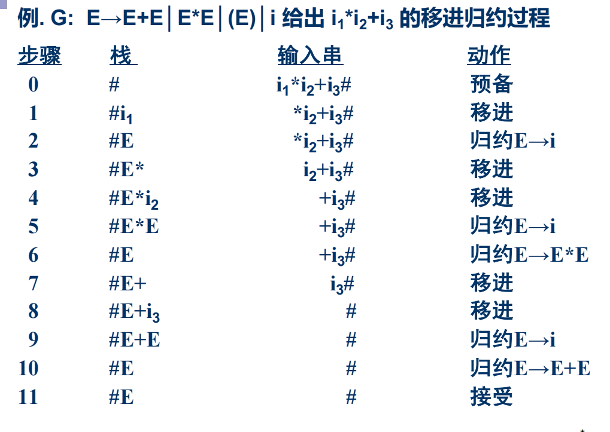
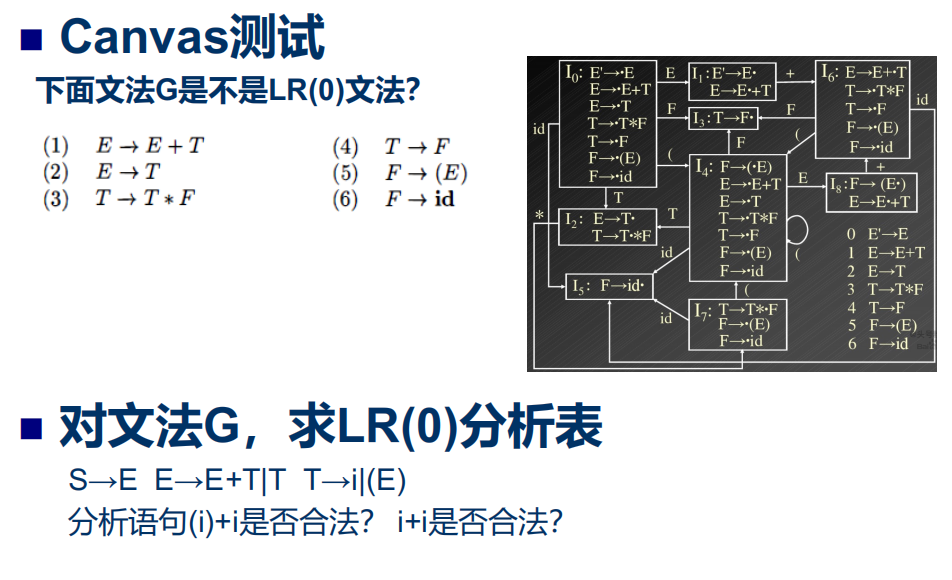
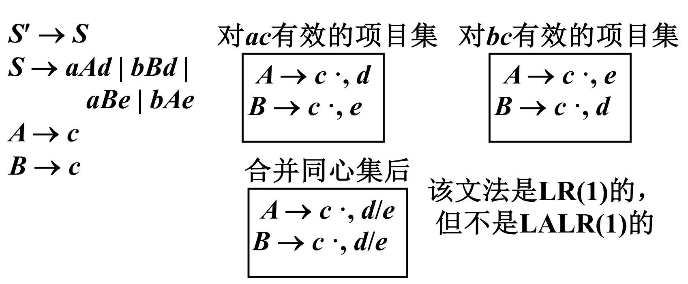
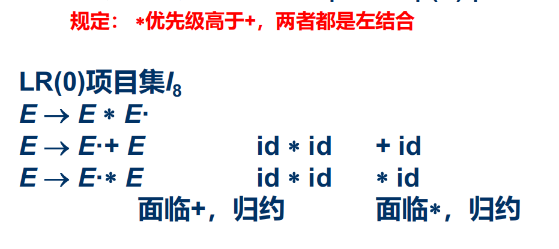

[TOC]
# 自下而上分析
发现自上而下语法要求太高
我们自下而上规约

移进-规约法：使用一个符号栈，把输入符号逐一移进栈，当**栈顶形成某个产生式右部**时，则将栈顶的这一部分规约为该**产生式的左部符号**

## 基本问题
- 如何找出或确定**可规约串**
- 对找出的可规约串替换为哪一个非终结符号

## 规范规约
令$G$是一个文法，$S$是文法的开始符号，**若$\alpha \beta \sigma$**是文法$G$的一个**句型**，如果有
$S \Rightarrow^{*} \alpha A \sigma$且$A \Rightarrow^{+} \beta$
则称$\beta$是句型$\alpha \beta \sigma$相对于非终结符$A$的**短语（找树的连续的有相同爸爸的叶子节点）**
特别地，若$A \Rightarrow \beta$，则称$\beta$是句型$\alpha \beta \sigma$关于产生式$A \rightarrow \beta$的直接短语
一个句型的**最左直接短语**称为**句柄**，我们就利用每次规约后的句型的句柄进行下一步规约

短语、句柄是**相对于句型的**

**例子**
$S \rightarrow aAcBe$
$A \rightarrow b$
$A \rightarrow Ab$
$B \rightarrow d$
给出句型$aAbcde$的短语、直接短语和句柄
$S \Rightarrow aAcBe \Rightarrow aAcde \Rightarrow aAbcde$
短语：$d, Ab, aAbcde$
直接短语：$d, Ab$
句柄：$Ab$在最左边的

假定$\alpha$时文法$G$的一个句子，我们称序列$\alpha_n, \alpha_{n-1},...,\alpha_0$是$\alpha$的一个**规范规约**
如果此序列满足
- $\alpha_n = \alpha$
- $\alpha_0$为文法的开始符，即$\alpha_0 = S$
- 对任何$i$，$0 \lt i \le n$，$\alpha_{i-1}$是从$\alpha_i$经把句柄替换为相应产生式的左部符号而得到的

规范规约是关于$\alpha$的一个最右推导的逆过程，因此**规范规约也成为最左规约**

**应该先画出语法树，然后再移进规约**

## 算法优先分析方法
比较简单，但是不规范
适用面很窄，但效率高
只适用于算符优先文法

这里**所有终结符都是算符**
优先级通过$\gt, \lt, =$定义
但$a \gt b$不等价于$a \lt b$

算符文法：**不允许非终结符连续出现**

讨论优先级，两个终结符直接或间接相邻(中间只有0/1个非终结符)

先规约的优先级大

算符优先文法：**所有算符之间的优先级没有冲突**

## LR分析方法
L表示从左向右扫描输入串，R表示构造最右推导的逆。LR分析法是严格的**规范规约**
不足在于**手工构造分析程序工作量相当大**(YACC即为一个语法分析程序的自动生成器)

文法 $\rightarrow$ 分析表(action/goto子表)，四种**分析表的构造方法**
- LR(0)表为基础，有局限性，只要是这个状态就规约
- SLR(Simple LR)看一下外面的是不是后继符，才规约，简单实用
- 规范LR表，LR(1)找源头，加入期待的符号，展望符，是期待的符号再规约LR(1)项目
  - shift、goto没有区别
  - 能力强、代价大
- LALR(向前LR)表，向前LR表，介于SLR和规范LR之间

LR分析总控程序通过分析表 
- 由输入得到输出
- 所有LR分析器总控程序相同

### 原理
在移进-规约过程中寻找句柄
- 历史：在分析栈中已移进和规约的符号串
- 展望：根据当前使用的产生式推测未来可能遇到的输入符号串(LR(1)就预测一个，LR(k)就预测k个)
- 现实：当前输入符号

把“历史”和“展望”总和抽象成**状态**
LR分析器实质上就是一个**有栈的DFA**
由栈顶的**状态**和现行的输入符号唯一确定每一步的工作

栈里面 状态 + 符号

### 分析表
核心部分
- action[s, a]: 当状态s面临**输入符号a**时，应采取什么**动作**
- goto[s, X]: 当状态s面临**文法符号X**时，**下一个状态**是什么
  - 定义了一个以**文法符号**为字母表的DFA

action[s, a]: 规定四种动作
- 移进 把(s, a)的下一个状态和输入符号a压入栈，下一个输入符号成为现行输入符号
- 规约 用某个产生式进行规约，推出的右部长度为r，规约动作为：
  - 去除栈顶r个顶，状态$s_{m-r}$变成栈顶状态
  - 把$(s_{m-r}, A)$的下一状态和文法符号A压入栈
  - 可以直接看DFA，根据**规约项目的右部确定需要往后退多少状态**，然后**根据规约项目的左部确定去到的下一个状态**
  - 但如果是$A \rightarrow \varepsilon$对应的$A \rightarrow \cdot$空字就不用退，也不用POP，直接加上左部，然后在原状态的基础上去到下一个状态
- 接收 宣布分析成功，停止分析器工作
- 报错

### 分析过程
(栈内状态序列, 移进规约串, 输入串)
#### 开始
$(S_0, \#, a_1a_2...a_n\#)$
#### 某一步
$(S_0S_1...S_m, \#X_1X_2...X_m, a_ia_{i+1}...a_n\#)$
#### 下一步
$ACTION[S_m, a_i]$
- 若为移进，且$GOTO[S_m, a_i] = S$
  - 则$(S_0S_1...S_mS, \#X_1X_2...X_ma_i, a_{i+1}...a_n\#)$
- 若为规约$\{A \rightarrow \beta \}$，且$|\beta| = r, \beta = X_{m-r+1}...X_m, GOTO[S_{m-r}, A] = S$
  - 则$(S_0S_1...S_{m-r}S, \#X_1X_2...X_{m-r}A, a_ia_{i+1}...a_n\#)$
  - 就是看着DFA要规约的那个状态，右部有多少个，就往回走多少个状态，然后走左部到下一个状态
  - 例如：$T \rightarrow (E) \cdot$，往回走三个状态(右部长度为三)，然后通过$T$(左部)得到下一个状态
- 若为接受则结束
- 若为报错则进行出错处理

#### Example

表中记号的意义
- sj： 把下一状态j和现行输入符号a移进栈
- rj：按照第j个产生式进行规约
- acc：接收
- 空白格：出错标志，报错

### LR文法
- 对于一个文法，如果能**够构造一张LR分析表**（关心的问题），使得它的**每个入口均是唯一确定**，则该文法成为LR文法
  - 自下而上分析时，一旦栈顶形成句柄，即可规约
- 对于一个文法，如果**每步至多向前检查k个输入符号**，才用LR分析器进行分析，则这个文法就成为LR(k)文法
  - 大多数程序语言符合LR(1)文法
- k = 0，即**只根据当前符号和历史信息**进行分析，无需展望

LE文法肯定是无二义的

画DFA的时候注意
- **递归的等价**
- **LR(1)的时候，不同的展望符就是不同的项目**

### LR(0)项目
文法$G$的产生式**右部**加一个圆点，称为$G$的一个LR(0)项目
它指明了在分析过程中的某时刻看到**产生式的多大部分**
计算机中利用一对整数表示<产生式编号, 圆点位置>
#### Example

### 活前缀
- 前缀：一个字的任意首部
  - 例如：字abc的前缀有$\varepsilon, a, ab, abc$
- 活前缀：规范句型的一个前缀，前缀的尾符号最多包含到句型的句柄，**即这种前缀不包含句柄之后的任何符号**
  - 对于规范句型$\alpha \beta \sigma$，$\beta$为句柄，如果$\alpha \beta = u_1u_2...u_r$，则符号串$u_1u_2...u_i(1 \le i \le r)$是$\alpha \beta \sigma$的活前缀($\sigma$为终结符号串)
- 在LR分析工作过程中的任何时候，栈里的文法符号(自栈底向上)应该构成活前缀
- 对于一个文法$G$，可以构造一个**识别$G$的所有活前缀有限状态机**，并以此构造LR分析表

### 构造分析表方法
这样两种方法最终的得到DFA一样的
#### 识别活前缀的NFA方法
构造识别文法所有活前缀的NFA
项目**1为NFA的唯一初态**，**任何状态(项目)均认为是NFA的终态**(活前缀识别态)
1. 情况1
   1. 若状态$i$为$X \rightarrow X_1 ... X_{i-1} \cdot X_i ... X_n$
   2. 且状态$j$为$X \rightarrow X_1 ... X_{i-1}X_i \cdot X_{i+1} ... X_n$
   3. 则从状态$i$画一条标志为$X_i$的有向边到状态$j$，即圆点只落后一个$X$
2. 情况2
   1. 若状态$i$为$X \rightarrow \alpha \cdot A \beta$，A为非终结符
   2. 则从状态$i$画一条$\varepsilon$边到所有状态$A \rightarrow \cdot \gamma$

- **圆点传递**！
- **非左最左**！

**Example**

- 先圆点转递

- 然后找右部，非终结符X左边圆点，指向X推出的右部的圆点在最左边

子集法化简
表序号一行一列从上到下从左到右

但是闭包的方法更好，**小圆点往后移，找等价右左最左**

#### LR(0)项目集 规范族
构成识别一个文法活前缀DFA的项目集(状态)的全体称为文法的**LR(0)项目集规范族**
- $A \rightarrow \alpha \cdot$规约项目
- $S' \rightarrow \alpha \cdot$接受项目
- $A \rightarrow \alpha \cdot a \beta(a \in V_T)$移进项目
- $A \rightarrow \alpha \cdot B \beta(B \in V_N)$待约项目

#### 拓广文法
为了使acc易于识别，我们把原有文法**拓广**
**引进**一个不出现在$G$中的非终结符$S'$
加入一个$S' \rightarrow S$
这样就会有一个仅含项目$S' \rightarrow S \cdot$的状态，**唯一的acc态**

##### 项目集I的闭包
项目集即为子集法构造完了的一个状态，包括了几个产生式的集合

I的闭包$CLOSURE(I)$
- I里面的项目也属于$CLOSURE(I)$
- 若$A \rightarrow \alpha \cdot B \beta \in CLOSURE(I)$，项目$B \rightarrow \cdot \gamma \in CLOSURE(I)$(之前的$\varepsilon$的指向等价)
- 重复上述步骤直到不再增加

##### 状态转换函数$GO(I, X)$
$GO(I, X) = CLOSURE(J)$

其中$J = \{ 任何形式如A \rightarrow \alpha X \cdot \beta | A \rightarrow \alpha \cdot X \beta \in I \}$
**$J$是$I$圆点按照$X$右移的集合**
**$X$是非终结符或终结符**
若$I$是对某个活前缀$\gamma$有效的项目集，$GO(I,X)$便是对$\gamma X$有效的项目集

**Example**
$G(S')$
$S' \rightarrow E$
$E \rightarrow aA|bB$
$A \rightarrow cA|d$
$B \rightarrow cB|d$

设$I = \{S' \rightarrow \cdot E\}$
$CLOSURE(I) = \{ S' \rightarrow \cdot E, E \rightarrow \cdot a A, E \rightarrow \cdot b B \}$(**本身加上右左最右**)

设$I_0 = \{ S' \rightarrow \cdot E, E \rightarrow \cdot a A, E \rightarrow \cdot b B \}$
$GO(I_0, E) = closure(J) = closure(\{S' \rightarrow E \cdot\}) = \{S' \rightarrow E \cdot\}$
- $J$去找$GO$的第**二个参数**的**左边有圆点的产生式**，然后**圆点移动**
- 闭包**本身加上右左最右**

### 构造LR(0)分析表
LR(0)文法的条件，每个状态集中不存在
- **又有移进项目又有规约项目，又移又规**
- **有多个规约项目，多规**

分析表构造
- 每个项目集的下标作为分析器的状态
- 圆点在在最后的都是规约$ACTION[k,a]$，rj，j为在文法中的第j个产生式
  - 注意acc，在$\#$(特殊的规约)
- 终结符的状态转换直接填上$ACTION$子表中的sj，j为转换的目标状态
- 非终结符的状态转换$GOTO$子表中的j，j为转换的目标状态

#### 例子

$I_2$又移又规了？

**第二题**
引入$S'$后文法如下
$S' \rightarrow S$
$S \rightarrow E$
$E \rightarrow E + T$
$E \rightarrow T$
$T \rightarrow i$
$T \rightarrow (E)$

### 构造SLR(1)分析表
在解决LR(0)冲突（某一状态又有移进又有规约）的时候，我们**向后**（展望）多看一个字符

#### 解决冲突算法
已知项目集$I$: 
m个移进项目
$A_1 \rightarrow \alpha_1 \cdot a_1 \beta_1$
$A_2 \rightarrow \alpha_2 \cdot a_2 \beta_2$
$A_3 \rightarrow \alpha_3 \cdot a_3 \beta_3$
...
$A_m \rightarrow \alpha_m \cdot a_m \beta_m$
n个规约项目
$B_1 \rightarrow \gamma_1 \cdot$
$B_2 \rightarrow \gamma_2 \cdot$
...
$B_n \rightarrow \gamma_n \cdot$

如果集合$\{ a_1, a_2, ..., a_m \}$和$FOLLOW(B_1), FOLLOW(B_2), ..., FOLLOW(B_n)$**两两不相交**，则可以按下面原则解决冲突
$a$是**下一个输入符号**
- 若$a \in \{ a_1, a_2, ..., a_m \}$，则移进$a$
- 若$a \in FOLLOW(B_i)$，则用$B_i \rightarrow \gamma_i$规约

不懂上面的有什么用，但是能推导出下边分析表怎么填

对于又有移进又有规约的项目集合，我们找到**规约项目**的**左部**的**后继符集合**，**在后继符集合中的才规约**，不在的该移进移进，该报错报错
**Example**
$I_2$
$E \rightarrow T \cdot$
$T \rightarrow T \cdot * F$
求规约项目$E \rightarrow T \cdot$中左部$E$的$FOLLOW(E) = \{\#, ), +\}$
因此action[2, #] = action[2, +] = action[2, )] = r2
然后剩下action[2, *]正常移进

### 构造规范LR分析表
[goodReference](https://blog.csdn.net/qq_40147863/article/details/93253171)
$FOLLOW$集合提供的信息还是太泛

我们需要重新定义项目，使得**每个项目都附带有k个终结符**，每个项目的一般形式都是$A \rightarrow \alpha \cdot, a_1a_2...a_k$，这样的一个项目称为LR(k)项目。其中$a_1a_2...a_k$为向前搜索符串(展望符)

展望符仅仅对**规约项目**$A \rightarrow \alpha \cdot, a_1a_2...a_k$**有意义**
该规约项目意味着，它所属的状态呈现在栈顶且**后续的k个输入符号**为$a_1a_2...a_k$时，才可以进行规约
**展望符是产生式左部分析完之后应该出现什么符号**
只用管等价出来的展望符，因为其他的都是继承来的
等价出来的展望符，要找**左部的来源的后面符号串加上其展望符的$FIRST$**
我们只对$k \le 1$讨论

$[A \rightarrow \alpha \cdot \beta, a]$对于活前缀$\gamma$是有效的$A \Rightarrow^* \sigma A \omega \Rightarrow \sigma \alpha \beta \omega$
- $\gamma = \sigma \alpha$
- $a$是$\omega$的第一个符号或者$a$为$\#$而$\omega$为$\varepsilon$

**那么填表的时候，对项目$A \rightarrow \alpha \cdot, b$，对任何终结符$a, a=b$才action[k, a] = rj进行规约**

注意多少个shift就多少根状态转移边

### 判断是不是XX文法
- 只要有移进规约冲突就不是LR(0)文法
- 规约项目的左部的$FOLLOW$中的符号和要移进的符号重复就不是SLR文法
- 规约项目的展望符和要移进的符号重复就不是LR(1)文法
  $A \rightarrow SA \cdot, b/a$
  $S \rightarrow \cdot b, b/a$
  这这里要在b/a符号填入rX，但是又要在b移进，所以重复

### LALR
规范LR(1)状态太多了
LALR合并**同心状态**，但是效率打折扣，原来可以bba#及时报错，但是LALR就不能了，会多一些规约过程然后才报错
与相应的SLR分析表具有相同数目的状态
不会引入**新的**移进规约冲突，但可能引入规约规约冲突

# 二义文法
简洁自然
可以人为消除二义
消除二义后语法分析效率高
