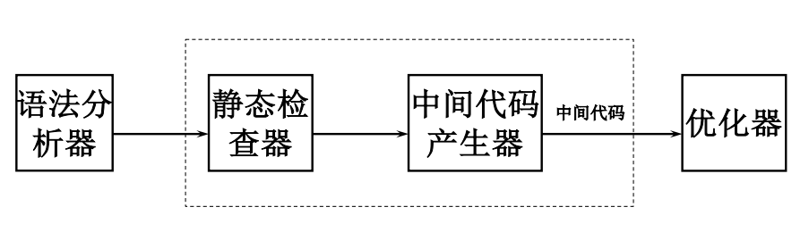
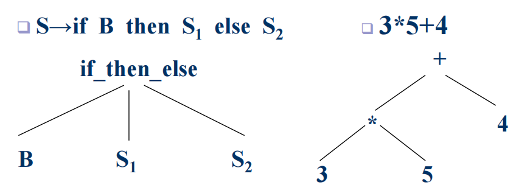
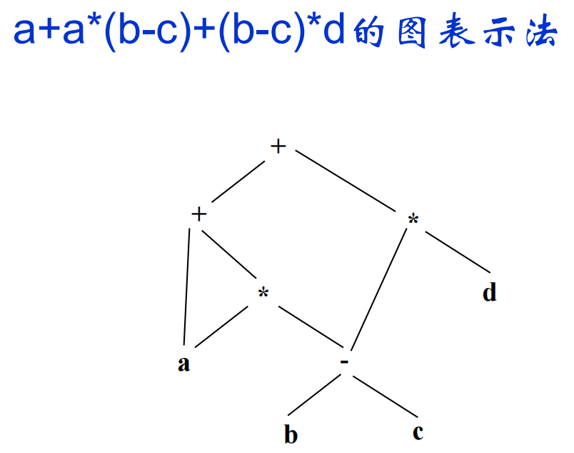
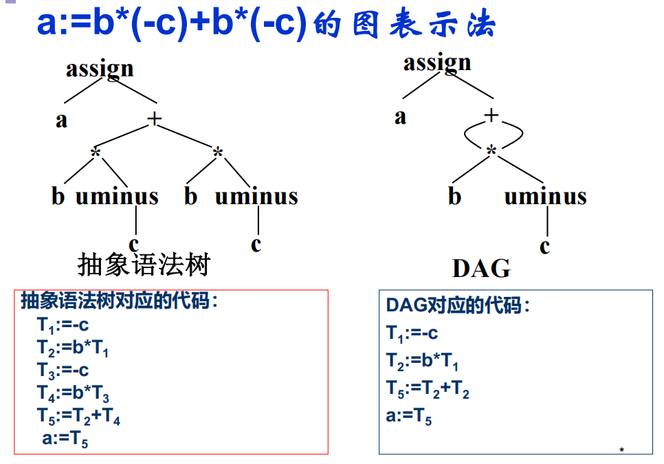

[TOC]
# 语义分析与中间代码产生

静态语义检查
- 类型检查
- 控制流检查
- 一致性检查
- 相关名字检查
- 名字的作用域分析

## 中间语言
中间语言(复杂性介于源语言和目标语言之间)好处
- 便于进行与及其无关的代码优化工作
- 易于移植(分为前端后端，不同高级语言，不同机器码)
- 使编译程序的结构在逻辑上更为简单明确

### 常见中间语言
- 后缀式
  - 逆波兰式
- 图表示
  - DAG(有向无循环图)，适合代码优化
  - 抽象语法树
- 三地址代码(最终选择)
  - 三元式
  - 四元式(实现的时候直接用，简单又直观)
  - 间接三元式

### 逆波兰式
表达式$E$的定义
- 如果$E$是一个变量或常量、$(E)$，则$E$的后缀式为$E$本身
- 如果$E$是$E_1 op E_2$形式的表达式，其中$op$是任何二元操作符，则$E$的后缀式为$E'_1E'_2op$，其中$E'_1$和$E'_2$分别为$E_1$和$E_2$的后缀式

给出下面表达式的逆波兰表示（后缀式）
- `a+b*(c+d/e)`
- `(A and B) or(not C or D)`
- `-a+b*(-c+d)`
- `(A or B) and (C or not D and E)`
- `a+a*(b-c)+(b-c)*d`
- `b:=-c*a+-c*a`

- `a b c d e / + * +`
- `A B and C not D or or`
- `a - c - d * + b +`
- `A B or C D not E and or and`
- `a b c - * a b c - d * + +`
- `b c a * - c a * - :=`

### 抽象语法树
在语法树中去掉非终结符，比较像中序遍历二叉树

### DAG
有向无环图
一个内部节点代表一个操作符，孩子是操作数
公共子表达式的节点具有多个父节点(优化)

### 三地址代码
抽象语法树/DAG的一种线性表示

#### 种类
- `x:=y op z`
- `x:=op y`
- `x:=y`
- `goto L`
- `if x relop y goto L`或`if a goto L`
- `param x`和`call p, n`以及返回语句`return y`
- `x:=y[i]`及`x[i]:=y`的索引赋值
- `x:=&y`，`x:=*y`和`x:=y`的地址和指针赋值

#### 四元式
`a:=b*(-c)+b*(-c)`

|op|arg1|arg2|result|
|:--:|:--:|:--:|:--:|
|uminus|$c$|&nbsp;|$T_1$|
|$*$|$b$|$T_1$|$T_2$|
|uminus|$c$|&nbsp;|$T_3$|
|$*$|$b$|$T_3$|$T_4$|
|$+$|$T_2$|$T_4$|$T_5$|
|$:=$|$T_5$|&nbsp;|$a$|

每个四元式通过临时变量联系
单目运算只用arg1域，转移语句将目标标号放入result域
arg1、arg2、result通常为指针，指向有关名字的符号表入口

修改容易，临时变量占空间

#### 三元式
`a:=b*(-c)+b*(-c)`

||op|arg1|arg2|
|:--:|:--:|:--:|:--:|
|(0)|uminus|$c$|&nbsp;|
|(1)|$*$|$b$|(0)|
|(2)|uminus|$c$|&nbsp;|
|(3)|$*$|$b$|(2)|
|(4)|$+$|(1)|(3)|
|(5)|assign|$a$|(4)|

修改比较难

#### 间接三元式
平衡上述两个
方便优化，节省空间
间接码表：一张治时期表，按运算的先后次序列出有关**三元式在三元式表中的位置**